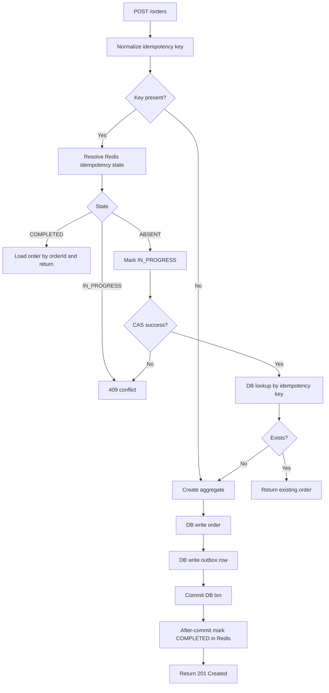
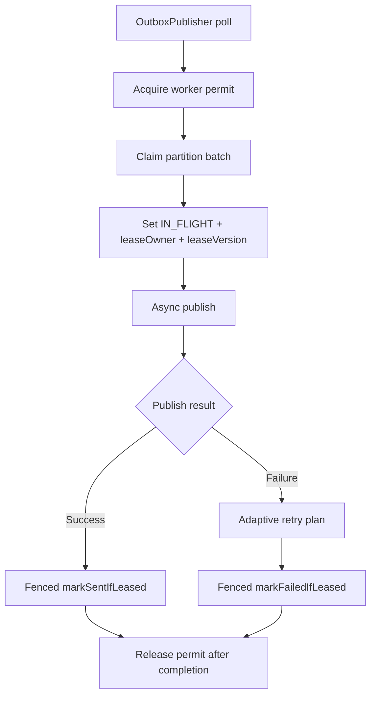
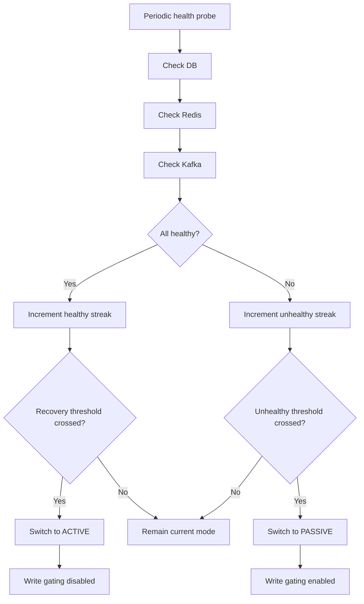
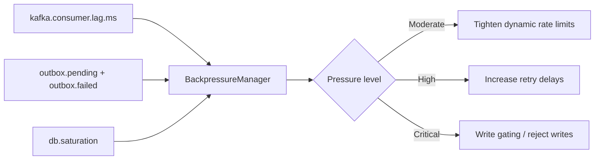
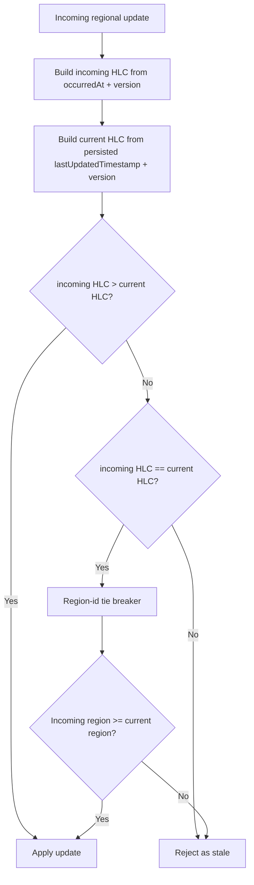

# Design and Architecture

## 1. Architectural Principles

The service is implemented with **Hexagonal Architecture**, **CQRS**, and **DDD aggregate modeling**.

- **Interface layer (`interfaces/http`)**: transport contracts, validation, error mapping
- **Application layer (`application/*`)**: command/query orchestration, ports, transactional boundaries
- **Domain layer (`domain/order/*`)**: aggregate behavior and state transition invariants
- **Infrastructure layer (`infrastructure/*`)**: persistence, messaging, cache, security, resilience, crosscutting controls

CQRS split:

- **Write side**: `OrderService`
- **Read side**: `OrderQueryService`

## 2. Core Design Decisions

### 2.1 Transactional Outbox over direct Kafka publish

Reason: commit order state and integration event atomically from the write transaction perspective.

- Order write and outbox row are persisted in one DB transaction
- Kafka publication is handled asynchronously by outbox workers
- Prevents "DB committed, broker send failed" inconsistency
- Worker claim semantics use explicit outbox leasing (`IN_FLIGHT`) with lease-expiry recovery to avoid duplicate concurrent publishers

### 2.2 State pattern for order lifecycle

Reason: enforce legal transitions in domain code, not controller/service condition chains.

- `Order` delegates behavior to `OrderState`
- Concrete states: `PendingState`, `ProcessingState`, `ShippedState`, `DeliveredState`, `CancelledState`
- Illegal transitions fail with `ConflictException`

### 2.3 Global idempotency lifecycle states

Reason: avoid false completion and data loss during partial failures.

- `IN_PROGRESS`: request accepted, business write not yet finalized
- `COMPLETED`: order commit succeeded and key is mapped to `orderId`
- completion is marked after commit via transaction synchronization

### 2.4 Active/passive write gating

Reason: prevent unsafe writes during regional dependency instability.

- `RegionalFailoverManager` monitors DB/Redis/Kafka health
- sustained unhealthy thresholds move region to passive
- write APIs are gated via `allowsWrites()`

### 2.5 Transaction manager disambiguation

Reason: transactional Kafka producer introduces additional transaction manager beans and can make Spring transaction selection ambiguous.

- DB service methods explicitly use `transactionManager`
- avoids accidental routing of JPA operations through non-JPA transaction managers

## 3. Consistency Model

### Strong consistency paths

- application write contracts use persistence-neutral `OrderRecord`
- `OrderEntity` remains infrastructure-only and is mapped in repository adapters
- optimistic locking on updates/cancel (`@Version`)
- idempotent create semantics with durable key lifecycle

### Eventual consistency paths

- post-create progression to `PROCESSING` via Kafka consumer
- outbox retries/backoff for asynchronous publication
- retry topics and DLT for consumer-side failure isolation

### Delivery contract (explicit)

- producer path is **transactional Kafka publish + transactional outbox**, not distributed XA across DB and Kafka
- end-to-end delivery guarantee is **at-least-once with idempotent consumption**
- ordering guarantee is **per partition/per order key**, not global total ordering across all orders
- active-active conflict handling is **version/timestamp/region precedence**, not causal consistency
- stale outbox workers are fenced by **`leaseOwner` + `leaseVersion`** checks on status transitions (`IN_FLIGHT` -> `SENT`/`FAILED`)

## 4. Write Path Architecture

### 4.1 Create order flow

1. Validate request and authorize endpoint
2. Check regional write mode
3. Resolve idempotency state
4. Persist order + outbox event in one transaction
5. Return response
6. Mark idempotency key `COMPLETED` after commit

### 4.2 Update and cancel flow

- retrieve aggregate snapshot
- apply state transition/cancel behavior in domain model
- persist with optimistic version checks
- evict query cache entries

### 4.3 Bounded read flow

- existing `GET /orders` remains backward-compatible
- `GET /orders/page` provides bounded page reads (`page`, `size`) with status filter support
- server caps page size to prevent unbounded memory pressure on high-cardinality datasets
- legacy `GET /orders` now executes through a bounded repository page (`app.query.list-max-rows`) to prevent unbounded heap growth

## 4.4 Order Creation Idempotency Flow (Detailed)

The create path is intentionally conservative because the system accepts retries from clients, API gateways, and load balancers.

Detailed sequence:

1. Normalize `X-Idempotency-Key` (trim, empty -> null).
2. Resolve global idempotency state from Redis.
3. If state is `COMPLETED` and an `orderId` exists, load and return the persisted order.
4. If state is `IN_PROGRESS`, reject with conflict to prevent duplicate concurrent writes.
5. Mark key `IN_PROGRESS` (compare-and-set semantics in Redis).
6. Perform a second local dedupe lookup by idempotency key in the DB.
7. Build domain aggregate from DTO, apply domain invariants, and stamp regional metadata.
8. Persist order snapshot in DB transaction.
9. Serialize and enqueue outbox event in the same DB transaction.
10. Commit DB transaction.
11. After commit callback marks global key `COMPLETED` -> `orderId`.
12. Return API response (new or deduped existing order).

## 10. Principal Hardening (P0/P1/P2)

### P0 reliability hardening (implemented)

- outbox publish path is now **completion-aware**: partition workers wait for async broker completions
- outbox publish concurrency is explicitly bounded by `app.outbox.publisher.max-in-flight`
- consumer flow no longer blocks listener threads with `Thread.sleep`; retries are delegated to retry-topic orchestration
- lease fencing uses both owner and version tokens to reject stale callbacks after reclaim

### P1 scalability hardening (implemented)

- list APIs are bounded by design (`/orders/page` and bounded fallback for `/orders`)
- cache/list semantics remain backward compatible while protecting against high-cardinality full scans

### P2 operational hardening (documentation + observability)

- explicit chaos/load test scenarios are now documented and tied to measurable SLO signals
- runtime dashboards map directly to outbox reclaim safety, DLQ drift, and backpressure transitions

## 5. Outbox Publication Pipeline

Components:

- `OutboxPublisher`: scheduler + backpressure + worker orchestration
- `OutboxFetcher`: partition-aware due row claim
- `OutboxProcessor`: async publish + success transition
- `OutboxRetryHandler`: retry policy and next-attempt scheduling

Behavioral properties:

- bounded in-flight workers
- bounded batch claim size
- deterministic row ordering within processing batch
- atomic lease transition (`PENDING`/`FAILED` -> `IN_FLIGHT`) before worker release
- lease timeout recovery for crashed workers
- at-least-once delivery with consumer dedupe

Detailed pipeline:

1. Scheduler selects only partitions owned by current instance.
2. Worker permit is acquired (bounded concurrency).
3. Fetcher claims due rows with `FOR UPDATE SKIP LOCKED` semantics.
4. Claimed rows are transitioned to `IN_FLIGHT` and assigned `leaseOwner + leaseVersion`.
5. Processor starts async publish per row (bounded in-flight publish semaphore).
6. Success callback attempts `markSentIfLeased(id, owner, version, ...)`.
7. If fenced update fails, callback is stale and safely ignored.
8. Failure callback runs adaptive retry policy and persists `FAILED + nextAttemptAt` with lease fencing.
9. Worker releases permit only after batch completion future resolves.

## 5.1 Lease Fencing and Stale Worker Protection

- Lease owner is unique per claim cycle and partition worker.
- Lease version increments on every claim.
- Success/failure transitions require both owner and version match.
- Any delayed callback from an expired lease cannot mutate the row.
- This is the core anti-duplication guarantee for asynchronous publication races.

## 5.2 Eventual Consistency Contract

- Command write commit and outbox insert are strongly consistent within one DB transaction.
- Kafka publication is asynchronous and eventually consistent.
- Consumer dedup markers enforce idempotent state application.
- End-to-end contract is at-least-once delivery with idempotent consume.

## 5.3 Regional Failover Decision Tree

## 5.4 Backpressure Propagation and Adaptive Throttling

## 5.5 Cross-Region HLC Conflict Resolution Flow

Hybrid Logical Clock (HLC) hardening replaces pure wall-clock ordering in conflict resolution.
Each candidate update is evaluated as a tuple: `(physicalMillis, logicalCounter)`.

Winning rule:

- incoming wins when `incoming.physicalMillis > current.physicalMillis`
- incoming wins when physical values are equal and `incoming.logicalCounter > current.logicalCounter`
- ties are broken deterministically by region id to prevent non-deterministic outcomes

This avoids false overwrite decisions caused by NTP drift when regions disagree on wall clock by small offsets.

## 6. Kafka Consume and Dedupe Architecture

`OrderCreatedConsumer` provides:

- schema validation/deserialization
- delayed processing enforcement window
- transactional dedupe marker + state transition
- retry topic routing for transient conditions
- DLT handling with structured diagnostics

`processed_events` table is the idempotent-consume anchor.

## 7. Redis Usage Model

### Query cache

- adapter: `RedisCacheProvider`
- cache-aside read strategy
- soft-fail fallback to DB
- local circuit-breaker behavior during repeated Redis faults
- TTL jitter for synchronized-expiry reduction

### Rate limiting

- filter: `RateLimitingFilter`
- token bucket in Lua for atomic refill/consume
- distributed key scope (`user:path:ip`)
- fail-open during Redis degradation to preserve availability

## 8. Security Model

- resource server JWT validation
- role claim conversion to Spring authorities
- endpoint-level access controls in `SecurityConfig`
- normalized API error envelope with correlation id

## 9. Failure Matrix

| Failure mode | Defensive mechanism | Observable outcome |
|---|---|---|
| create transaction fails | transactional rollback | no order, no outbox row |
| broker unavailable | outbox lease + adaptive retries/backoff | pending/in-flight/failed backlog grows then drains |
| duplicate Kafka delivery | processed-event dedupe | idempotent consume, no repeated transition |
| Redis cache failure | fail-soft cache adapter | DB fallback, increased cache error metrics |
| rate limiter Redis failure | fail-open policy | API remains available |
| stale concurrent write | optimistic locking | conflict response |
| prolonged dependency outage | active/passive failover | writes rejected in passive region |

