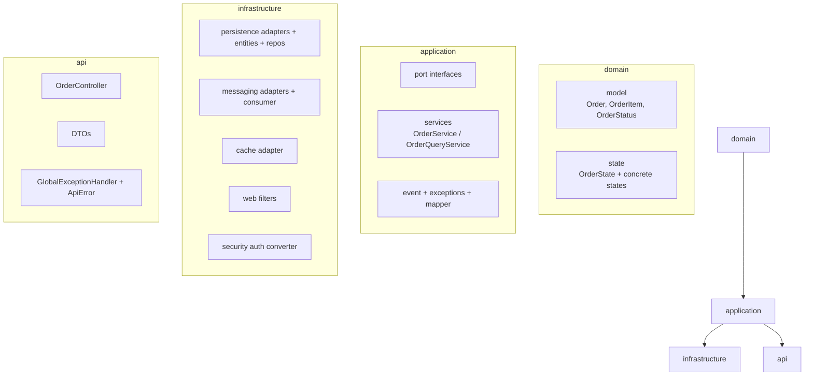
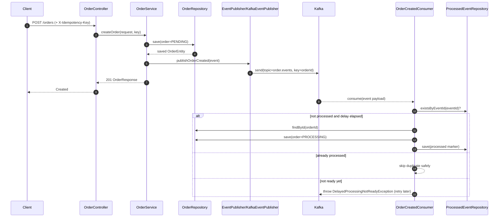
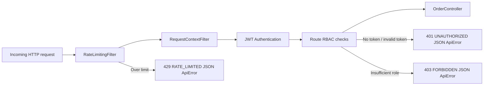
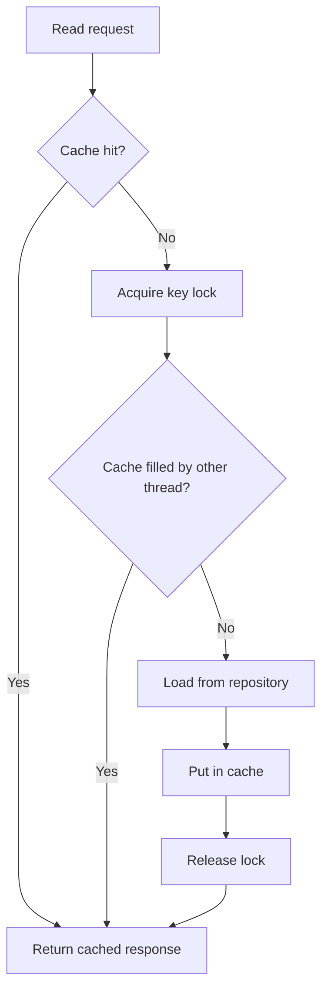

# Design and Architecture

## Architectural style

The project follows a **Hexagonal (Ports and Adapters)** architecture with **CQRS**.

- Domain contains business rules and lifecycle invariants.
- Application layer orchestrates use-cases and depends on ports.
- Infrastructure layer provides adapters to Kafka, persistence, cache, and web filters.
- API layer exposes HTTP endpoints and maps transport concerns.

CQRS split:

- **Write side:** `OrderService`
- **Read side:** `OrderQueryService`

## Why this architecture

- Keeps domain logic isolated from framework details.
- Makes external dependencies replaceable via ports.
- Supports independent evolution of reads/writes.
- Improves testability: domain can be tested without Spring/Kafka/DB.

## Layered package map

## Domain model design

### Aggregate root: `Order`

`Order` encapsulates state and lifecycle transitions. It exposes behavior:

- `updateStatus(target)`
- `cancel()`
- `promotePendingToProcessing()`

The aggregate carries:

- `id`
- `createdAt`
- `idempotencyKey`
- `items`
- `version`
- `currentState`

### State Pattern

Order transition logic is delegated to `OrderState` implementations:

- `PendingState`
- `ProcessingState`
- `ShippedState`
- `DeliveredState`
- `CancelledState`

`AbstractOrderState` centralizes transition lookup and conflict handling. Invalid transitions throw `ConflictException`.

### Lifecycle rules enforced

- Cancel allowed only while `PENDING`.
- Pending can auto-promote to processing after delay.
- Terminal states (`DELIVERED`, `CANCELLED`) do not transition.

## CQRS and consistency model

- Writes happen through `OrderService` and persist to DB.
- Reads happen through `OrderQueryService` with cache-aside strategy.
- Eventual processing (`PENDING -> PROCESSING`) is asynchronous via Kafka event consumption.
- Consumer idempotency ensures retries do not duplicate side effects.

## Concurrency and integrity strategy

- **Optimistic locking:** `@Version` on `OrderEntity.version`.
- **Version check:** API update request includes expected version.
- **Idempotent creates:** `X-Idempotency-Key` mapped to unique DB key.
- **Consumer idempotency:** `processed_events` table keyed by unique `eventId`.

## Error boundary strategy

- Domain/application failures surfaced as typed exceptions:
  - `NotFoundException`
  - `ConflictException`
  - `InfrastructureException`
- API exception handler maps these to stable HTTP responses and structured `ApiError` payloads.

## Security architecture summary

- Stateless JWT Bearer authentication.
- `roles` claim mapped to `ROLE_*` authorities.
- Route-level RBAC in `SecurityConfig`.
- Rate limiter as servlet filter before auth chain.
- Request correlation middleware sets/propagates `X-Request-Id`.

## Additional interactive design docs

### Sequence: create order and delayed processing

### Security request path and policy enforcement

### Cache-aside and stampede-control behavior

