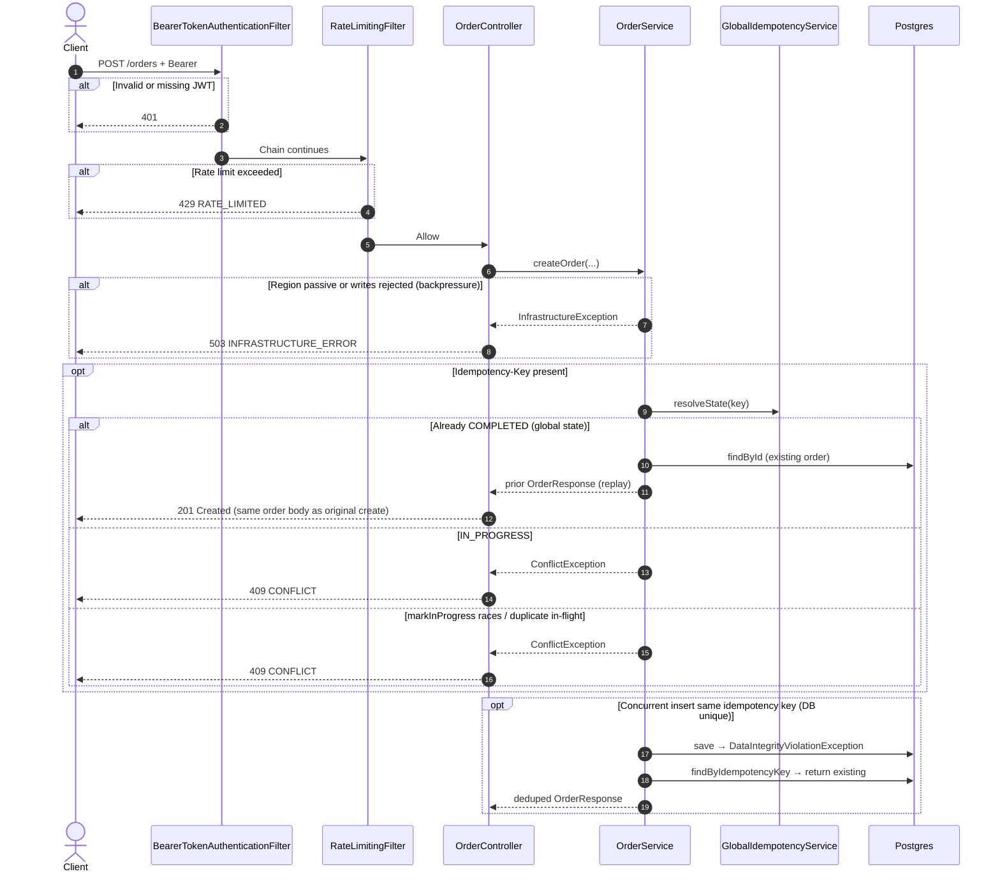
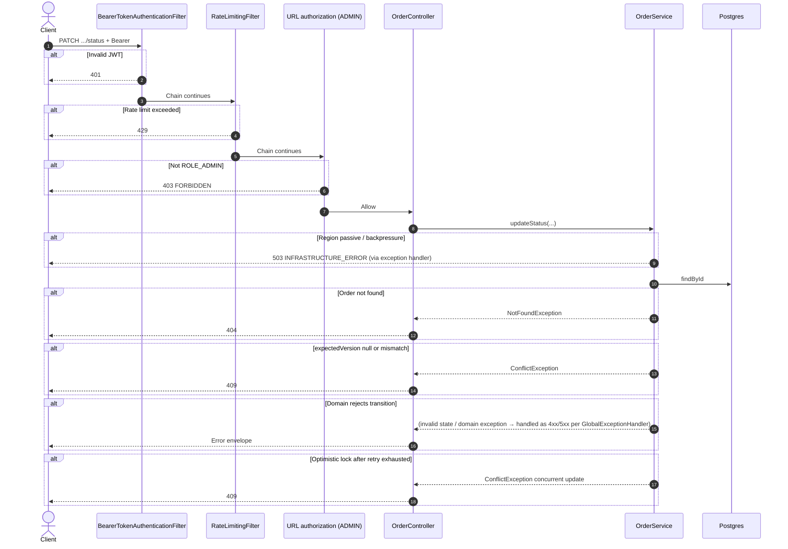
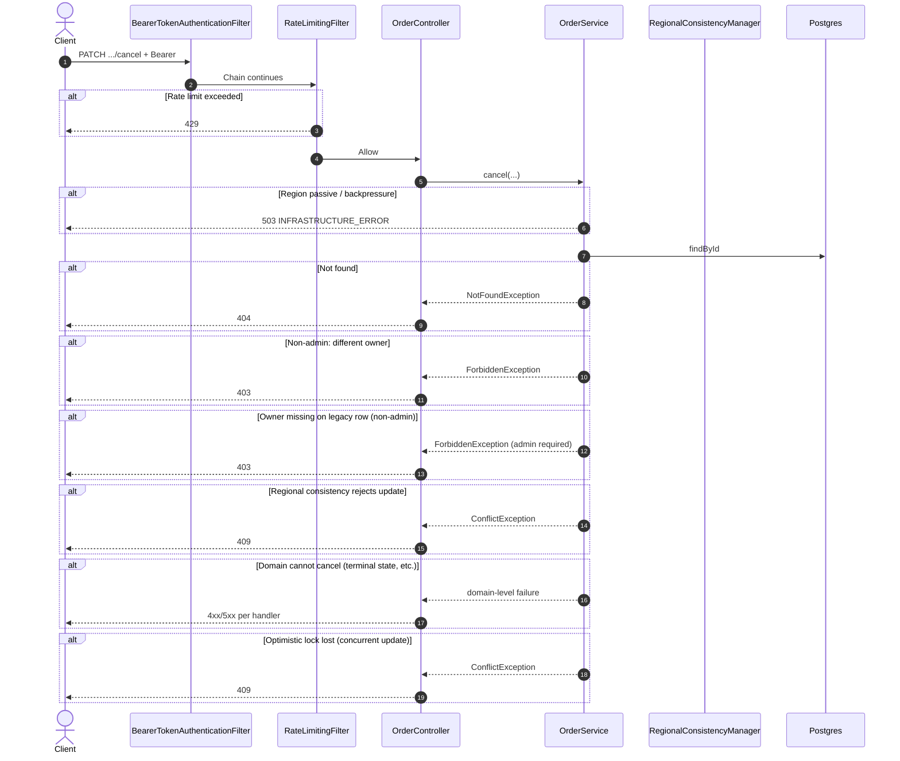
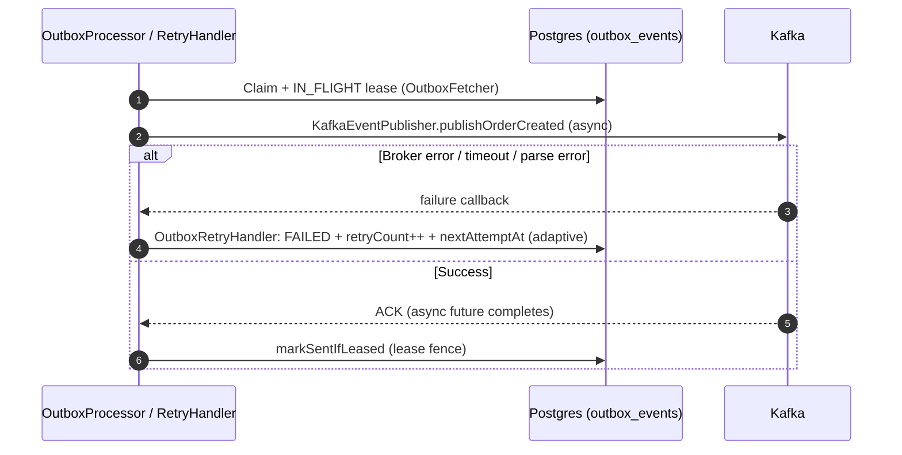

# Failure Scenarios

This page documents **failure paths, guardrails, and degraded behavior** for each `OrderController` API, plus related **infrastructure and background** failure modes. Diagrams use `alt` / `opt` blocks where they clarify branching. Error envelopes follow `ApiError` (`code`, `message`, `requestId`, `timestamp`); see [Security and Authorization]({{ '/security-and-authorization/' | absolute_url }}) for HTTP status mapping.

---

## Cross-cutting failures

Filter order matches `SecurityConfig`: **JWT (`BearerTokenAuthenticationFilter`) → `RateLimitingFilter` → URL authorization → controller**. A missing/invalid token is rejected by the resource server **before** rate limiting runs on that path; a valid token can still hit **429** from `RateLimitingFilter` later in the chain.

| Condition | Typical outcome |
|-----------|-----------------|
| Missing / invalid JWT | **401** from `SecurityConfig` authentication entry point (OAuth2 resource server) |
| Valid JWT but insufficient role (e.g. non-admin calls `PATCH .../status`) | **403** from access denied handler when URL rules fail |
| Rate limit exceeded | **429** `RATE_LIMITED` from `RateLimitingFilter` |
| Region in passive mode OR write backpressure | **503** `INFRASTRUCTURE_ERROR` from `OrderService.assertWriteAllowed()` on **writes** (`InfrastructureException` → generic upstream message) |
| Global idempotency Redis unavailable on `markInProgress` | **Fail-open** (`markInProgress` returns `true`); cross-request dedupe is weakened (see `GlobalIdempotencyService`) |

---

## POST `/orders` — Create order



**Async path (outbox → Kafka):** If the broker or schema validation fails, the outbox row is retried with backoff; the HTTP client has already received **201**—see [Outbox / Kafka failures]({{ '/failure-scenarios/' | absolute_url }}#outbox--kafka-failures).

---

## GET `/orders/{id}` — Get by id

```mermaid
sequenceDiagram
    autonumber
    actor Client
    participant JWT as BearerTokenAuthenticationFilter
    participant RL as RateLimitingFilter
    participant API as OrderController
    participant Query as OrderQueryService
    participant Cache as Redis
    participant DB as Postgres

    Client->>JWT: GET /orders/{id} + Bearer
    alt Invalid JWT
        JWT-->>Client: 401
    end
    JWT->>RL: Chain continues
    alt Rate limit exceeded
        RL-->>Client: 429
    end

    RL->>API: Allow
    API->>Query: getById(...)

    Query->>Cache: get
    alt Redis error on read
        Note over Query, Cache: Implementation returns empty Optional; falls through to DB load
        Query->>DB: load order
    end

    alt Non-admin: order owned by another subject
        DB-->>Query: empty
        Query-->>API: NotFoundException
        API-->>Client: 404 (no existence leak)
    end

    alt Order missing
        Query-->>API: NotFoundException
        API-->>Client: 404
    end
```

---

## PATCH `/orders/{id}/status` — Update status (ADMIN)



---

## GET `/orders` — List

```mermaid
sequenceDiagram
    autonumber
    actor Client
    participant JWT as BearerTokenAuthenticationFilter
    participant RL as RateLimitingFilter
    participant API as OrderController
    participant Query as OrderQueryService
    participant Cache as Redis
    participant DB as Postgres

    Client->>JWT: GET /orders + Bearer
    JWT->>RL: Chain continues
    alt Rate limit exceeded
        RL-->>Client: 429
    end

    RL->>API: Allow
    API->>Query: list(...)
    Query->>Cache: get list key
    alt Redis unavailable for cache op
        Note over Query: Treat as miss; coalesced DB load
        Query->>DB: query
    end
    alt DB failure
        Query-->>API: RuntimeException → 500 path + metrics
    end
```

Non-admin callers only see **their** orders; admin callers see a **global** list capped by configured max rows.

---

## GET `/orders/page` — Paginated list

```mermaid
sequenceDiagram
    autonumber
    actor Client
    participant JWT as BearerTokenAuthenticationFilter
    participant RL as RateLimitingFilter
    participant API as OrderController
    participant Query as OrderQueryService
    participant DB as Postgres

    Client->>JWT: GET /orders/page + Bearer
    JWT->>RL: Chain continues
    alt Rate limit exceeded
        RL-->>Client: 429
    end

    RL->>API: Allow
    API->>Query: listPage(...)
    Note over Query: page &lt; 0 normalized to 0; size clamped [1, 500]
    Query->>DB: page query
    alt DB failure
        Query-->>API: error → 500 + orders.query.error.count
    end
```

---

## PATCH `/orders/{id}/cancel` — Cancel



---

## Outbox / Kafka failures

Applies after **successful** `POST /orders` commit.

1. Publisher claims rows; **Kafka down** → retry with backoff; row may become `FAILED` then recover.
2. **Schema validation** failure → row not published; metrics `kafka.schema.validation.errors` (see implementation).
3. No duplicate HTTP side effects: source of truth remains **Postgres** until `SENT`.



---

## Scheduled `PENDING` → `PROCESSING` (not HTTP)

Automatic promotion runs on a **scheduler**, not in the Kafka consumer. Failures include optimistic conflicts (another writer won) and regional consistency skips—see [Design and Architecture]({{ '/design-and-architecture/' | absolute_url }}).

---

## Kafka consumer / dedupe (not HTTP)

The `ORDER_CREATED` consumer records **processed event** markers for idempotent handling; transient DB errors trigger retries / DLT per configuration. This does **not** promote `PENDING`→`PROCESSING` in the current design.

---

## Rate limiting and Redis degradation

| Component | Redis failure behavior |
|-----------|-------------------------|
| `RateLimitingFilter` | Primary script failure may try **sliding-window** fallback; if that fails → **fail-open** (allow) + `redis.connection.failures` |
| Read cache (`RedisCacheProvider`) | Miss path → **database**; API remains available with higher latency |

---

## Consistency notes

- **Idempotency** (create) and **optimistic locking** (status / cancel) reduce duplicate and stale writes.
- **Cross-region** behavior is governed by `RegionalConsistencyManager` and failover policy; writes may be disabled when the node is passive.
