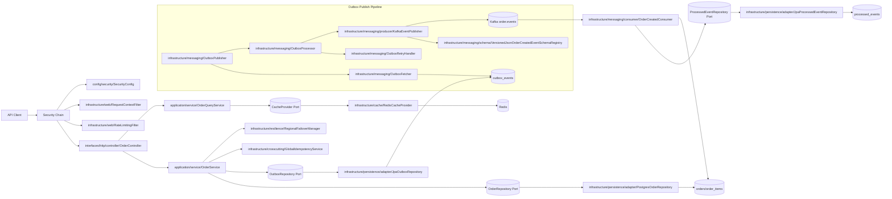
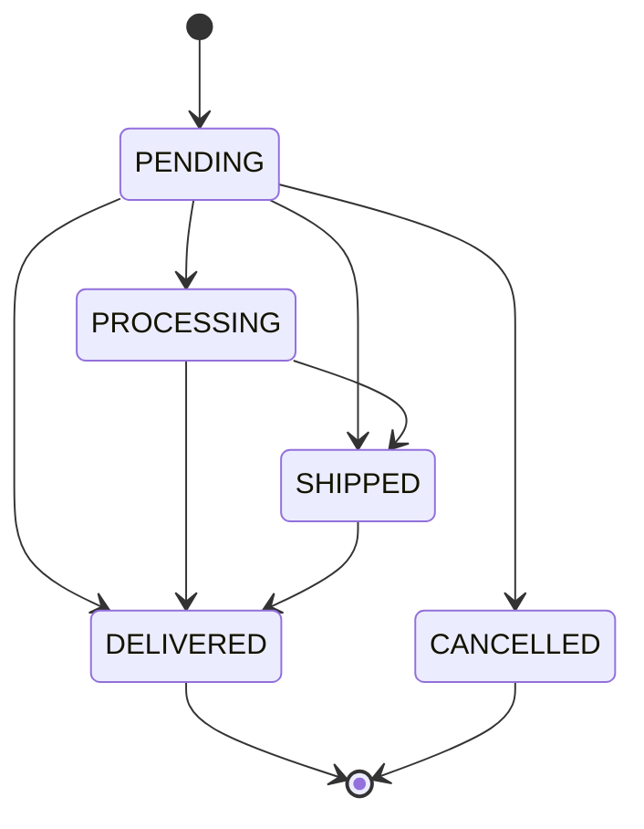
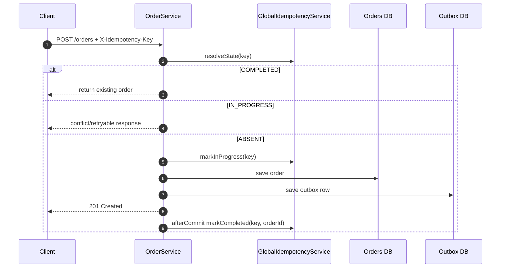

# Order Processing System Documentation

This documentation describes the current implementation after architecture/package refactors, idempotency lifecycle hardening, and test expansion.

## Quick Start

- Build: `mvn clean compile`
- Run: `mvn spring-boot:run`
- Tests: `mvn test`
- App package root: `src/main/java/com/example/orderprocessing`

## Implementation Snapshot

- **Architecture:** Hexagonal + CQRS + DDD aggregate/state pattern
- **Write correctness:** idempotency (`IN_PROGRESS`/`COMPLETED`), optimistic locking, outbox
- **Async reliability:** partitioned outbox workers, retry/backoff, Kafka consumer retries + DLT
- **Read performance:** cache-aside query service + stampede coalescing + Redis circuit-breaker
- **Resilience:** active/passive regional write gating + dependency health checks
- **Security:** JWT resource server + role-based route authorization + normalized API errors
- **Observability:** Micrometer metrics, structured logs, tracing hooks

## Architecture Diagrams

### End-to-end Runtime View

### Order State Lifecycle

### Idempotent Create Lifecycle

## Documentation Structure

### Core Guides

- [Design and Architecture](./design-and-architecture.md)
- [Components and Tooling](./components-and-tooling.md)
- [Observability and Operations](./observability-and-operations.md)
- [Testing and Quality](./testing-and-quality.md)
- [Use Cases and Failure Scenarios](./use-cases-and-failure-scenarios.md)

### Layered Reference

- [Reference Index](./reference/index.md)
- [Interface HTTP Layer](./reference/api-layer.md)
- [Application Layer](./reference/application-layer.md)
- [Domain Layer](./reference/domain-layer.md)
- [Infrastructure Layer](./reference/infrastructure-layer.md)
- [Configuration and Runtime](./reference/configuration-and-runtime.md)
- [Folder and Class Reference](./folder-and-class-reference.md)
