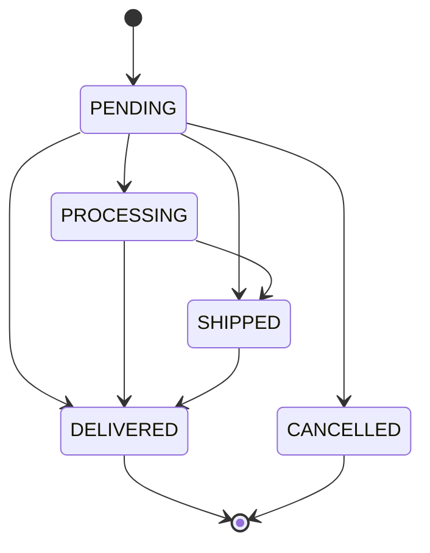
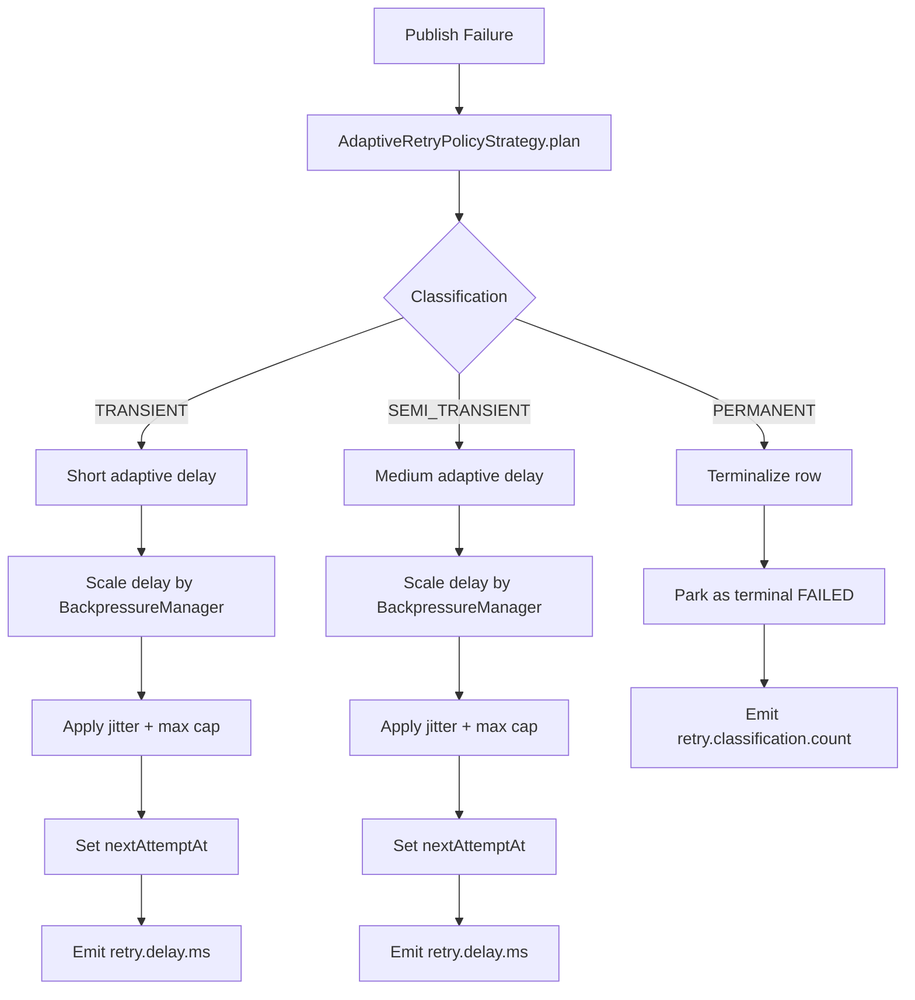
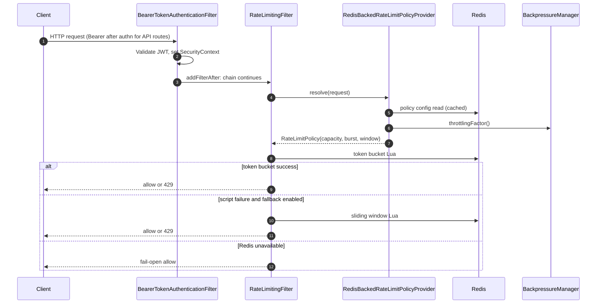
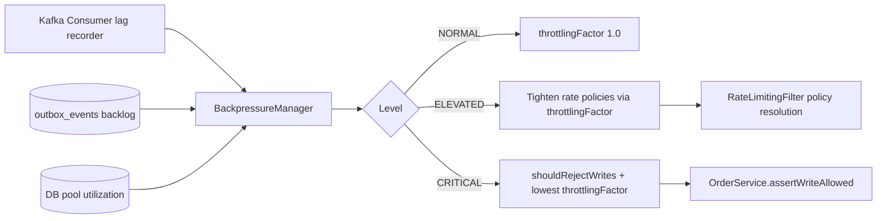

# Order Processing System Documentation

This documentation describes the current implementation: transactional outbox, **scheduled** `PENDING`→`PROCESSING` promotion (not performed by the Kafka consumer), **JWT-scoped read and cancel** authorization with cache-isolated keys, adaptive retry, dynamic rate limiting, regional consistency controls, transactional Kafka publishing, and system-wide backpressure propagation.

## Quick Start

- Build: `mvn clean compile`
- Run: `mvn spring-boot:run`
- Tests: `mvn test`
- App package root: `src/main/java/com/example/orderprocessing`

## Implementation Snapshot

- **Architecture:** Hexagonal + CQRS + DDD aggregate/state pattern
- **Write correctness:** idempotency (`IN_PROGRESS`/`COMPLETED`), optimistic locking, outbox; order **ownership** (`owner_subject` = JWT `sub`) on create
- **Scheduling:** `PendingToProcessingScheduler` → `OrderService.promotePendingOrdersScheduled()` (configurable interval); sole automatic `PENDING`→`PROCESSING` path
- **Async reliability:** partitioned outbox workers, adaptive retry classification, Kafka consumer retries + DLT; consumer writes **dedupe markers only** (no status promotion)
- **Read performance:** cache-aside query service + stampede coalescing + Redis circuit-breaker; **admin vs owner-scoped cache keys** (`OrderReadCacheKeys`)
- **Read authorization:** non-admins scoped by `owner_subject` on get/list/page; cross-tenant get → `404`
- **Resilience:** active/passive failover + active-active consistency conflict checks + system-wide backpressure
- **Security:** JWT resource server + RBAC + resource-level rules ([Security and Authorization]({{ '/security-and-authorization/' | absolute_url }}))
- **Observability:** Micrometer metrics (including `api.errors.unexpected`), structured logs, tracing hooks
- **CI:** GitHub Actions `mvn clean test` on push/PR to mainline branches (see repository `.github/workflows/ci.yml`)

## Architecture Diagrams

### End-to-end Runtime View

```mermaid
flowchart LR
    subgraph admission [HTTP admission matches SecurityFilterChain order]
      direction LR
      RC[RequestContextFilter] --> BEAR[BearerTokenAuthenticationFilter]
      BEAR --> RL[RateLimitingFilter]
      RL --> AUTHZ[AuthorizationFilter URL rules]
      AUTHZ --> API[interfaces/http/controller/OrderController]
    end

    Client[API Client] --> RC

    API --> WS[application/service/OrderService]
    API --> QS[application/service/OrderQueryService]

    WS --> ORD[(OrderRepository Port)]
    ORD --> JPA[infrastructure/persistence/adapter/PostgresOrderRepository]
    JPA --> DB[(orders/order_items)]

    WS --> OUT[(OutboxRepository Port)]
    OUT --> OUTJPA[infrastructure/persistence/adapter/JpaOutboxRepository]
    OUTJPA --> ODB[(outbox_events)]

    subgraph Outbox Publish Pipeline
      PUB[infrastructure/messaging/OutboxPublisher] --> FCH[infrastructure/messaging/OutboxFetcher]
      FCH --> ODB
      PUB --> PROC[infrastructure/messaging/OutboxProcessor]
      PROC --> RET[infrastructure/messaging/OutboxRetryHandler]
      PROC --> KEP[infrastructure/messaging/producer/KafkaEventPublisher]
      KEP --> SR[infrastructure/messaging/schema/VersionedJsonOrderCreatedEventSchemaRegistry]
      KEP --> K[(Kafka order.events)]
    end

    K --> KC[infrastructure/messaging/consumer/OrderCreatedConsumer]
    SCH[infrastructure/scheduling/PendingToProcessingScheduler] --> WS
    KC --> PR[(ProcessedEventRepository Port)]
    PR --> PRJPA[infrastructure/persistence/adapter/JpaProcessedEventRepository]
    PRJPA --> PDB[(processed_events)]
    KC --> DB

    QS --> CP[(CacheProvider Port)]
    CP --> RCP[infrastructure/cache/RedisCacheProvider]
    RCP --> REDIS[(Redis)]

    WS --> GID[infrastructure/crosscutting/GlobalIdempotencyService]
    WS --> RCM[infrastructure/resilience/RegionalConsistencyManager]
    WS --> BPM[infrastructure/resilience/BackpressureManager]
    RL --> RPP[infrastructure/web/ratelimit/RedisBackedRateLimitPolicyProvider]
    RPP --> REDIS
    RPP --> BPM
    KC --> BPM
    PROC --> RPS[infrastructure/messaging/retry/AdaptiveRetryPolicyStrategy]
    KC --> SKR[Spring Kafka @RetryableTopic + DLT]
    RCM --> RFM[infrastructure/resilience/RegionalFailoverManager]
    RCM --> CRS[infrastructure/resilience/conflict/ConflictResolutionStrategy]
```



**Notes:** `RequestContextFilter` is a separate `@Component` servlet filter (ordering is Spring Boot’s default; it usually runs **before** `DelegatingFilterProxy` / `SecurityFilterChain`). In `SecurityConfig`, **`RateLimitingFilter` is registered immediately after** `BearerTokenAuthenticationFilter`—that **adjacency** is what the diagram emphasizes; other framework filters (including **`AuthorizationFilter`** for `authorizeHttpRequests`) sit **later** in the same chain before the dispatcher reaches `OrderController`. Outbox publish failures use `AdaptiveRetryPolicyStrategy` / `OutboxRetryHandler`; the Kafka **consumer** uses **`@RetryableTopic`** and **DLT**, not `RetryPolicyStrategy`.

### Order State Lifecycle



The domain allows multiple transitions from `PENDING` (including direct `SHIPPED` / `DELIVERED` for admin-driven API updates). The **automatic** path from backlog to fulfillment uses **`PENDING` → `PROCESSING`** via the **scheduler**, not via Kafka consumption.

### Idempotent Create Lifecycle

```mermaid
sequenceDiagram
    autonumber
    participant C as Client
    participant OS as OrderService
    participant G as GlobalIdempotencyService
    participant DB as Orders DB
    participant O as Outbox DB

    Note over C, O: Preconditions: JWT auth + rate limit + USER/ADMIN (controller); then assertWriteAllowed()

    C->>OS: createOrder (via OrderController)
    OS->>OS: assertWriteAllowed (region + backpressure)
    OS->>G: resolveState(key) / markInProgress (if key)
    opt DB dedupe by idempotency key after Redis reservation
      OS->>DB: findByIdempotencyKey — return existing if found
    end
    alt COMPLETED in Redis
      OS->>DB: findById(orderId) → return existing
      OS-->>C: 201 + body
    else IN_PROGRESS
      OS-->>C: 409 CONFLICT
    else proceed to create
      OS->>G: markInProgress when ABSENT
      OS->>DB: save order + outbox row (one transaction)
      OS-->>C: 201 Created
      OS->>G: afterCommit markCompleted(key, orderId)
    end
```

### Adaptive Outbox Retry Lifecycle



### Dynamic Rate Limiting Flow



### Global Backpressure Propagation



## Documentation Structure

Cross-links below use Jekyll’s `absolute_url` filter with `url` and `baseurl` from [`docs/_config.yml`](https://github.com/AbhinavT09/OrderProcessingSystem/blob/main/docs/_config.yml) so the built site on [GitHub Pages](https://abhinavt09.github.io/OrderProcessingSystem/) emits fully qualified URLs. Viewing `.md` on GitHub shows Liquid until the Pages build runs.

### Core Guides

- [Design and Architecture]({{ '/design-and-architecture/' | absolute_url }})
- [Security and Authorization]({{ '/security-and-authorization/' | absolute_url }})
- [Components and Tooling]({{ '/components-and-tooling/' | absolute_url }})
- [Observability and Operations]({{ '/observability-and-operations/' | absolute_url }})
- [Testing and Quality]({{ '/testing-and-quality/' | absolute_url }})
- [Use Cases]({{ '/use-cases/' | absolute_url }})
- [Failure Scenarios]({{ '/failure-scenarios/' | absolute_url }})

### Layered Reference

- [Reference Index]({{ '/reference/' | absolute_url }})
- [Interface HTTP Layer]({{ '/reference/api-layer/' | absolute_url }})
- [Application Layer]({{ '/reference/application-layer/' | absolute_url }})
- [Domain Layer]({{ '/reference/domain-layer/' | absolute_url }})
- [Infrastructure Layer]({{ '/reference/infrastructure-layer/' | absolute_url }})
- [Configuration and Runtime]({{ '/reference/configuration-and-runtime/' | absolute_url }})
- [Folder and Class Reference]({{ '/folder-and-class-reference/' | absolute_url }})
