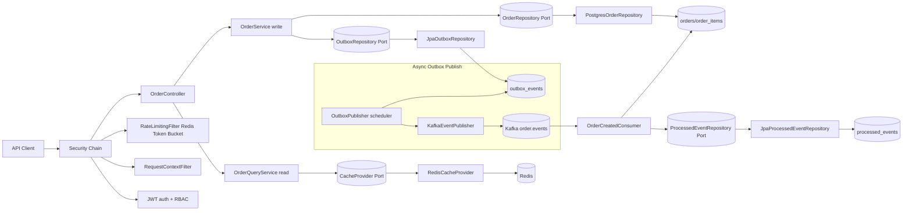
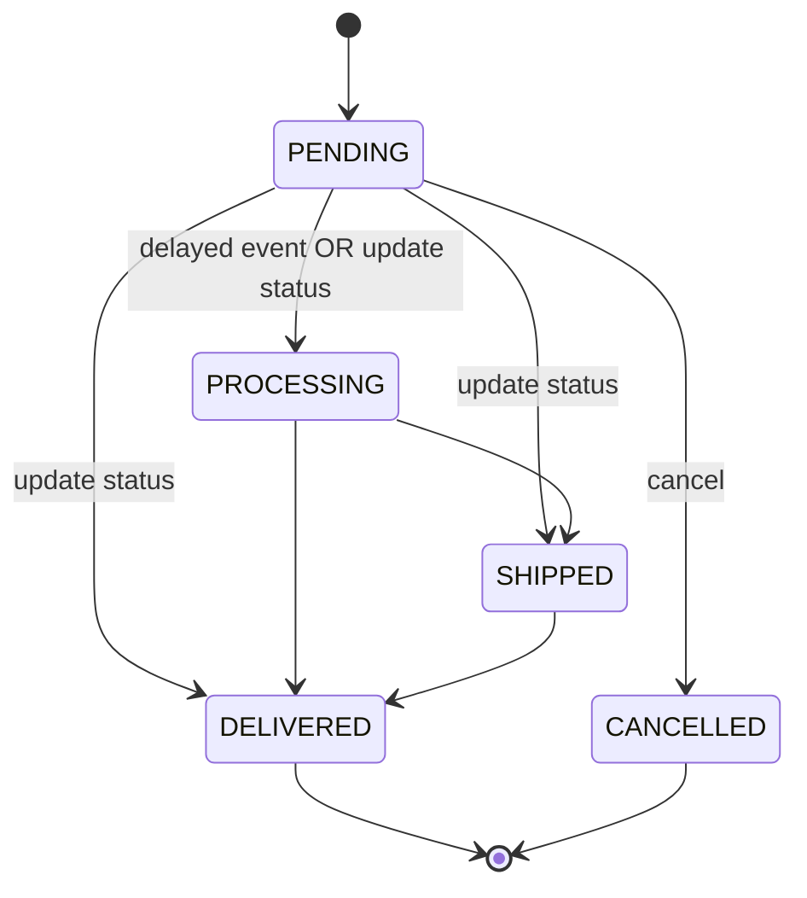
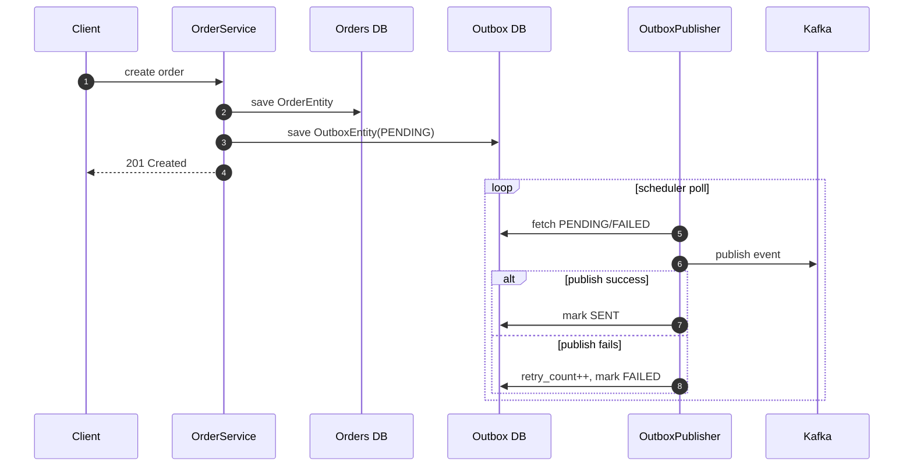

# Order Processing System - Project Documentation

This documentation reflects the **current implementation** of the project, including outbox publishing, Redis-backed caching/rate-limiting, Kafka reliability controls, and observability.

## System capabilities

- Hexagonal architecture with CQRS (`OrderService` write side, `OrderQueryService` read side)
- Domain aggregate with State Pattern (`Order` + `OrderState` hierarchy)
- Transactional Outbox pattern for reliable event publishing
- Kafka delayed processing with retry topics + DLQ
- Redis-backed distributed cache (JSON serialization + TTLs)
- Redis-backed distributed token-bucket rate limiting (Lua + atomic updates)
- JWT auth + RBAC + validation + structured API errors
- Prometheus metrics + tracing + structured JSON logs

## Interactive architecture diagrams

### Full runtime flow



### State transition model



### Outbox reliability sequence



## Documentation map

- [Design and Architecture](./design-and-architecture.md)
- [Components and Tooling Rationale](./components-and-tooling.md)
- [Observability, Logging, Monitoring](./observability-and-operations.md)
- [Folder and Class Reference](./folder-and-class-reference.md)
- [Testing and Quality Strategy](./testing-and-quality.md)

## Runtime prerequisites

- Java 17
- Maven 3.9+
- Redis (cache + distributed rate limiting)
- Kafka broker
- Optional OTEL collector (`http://localhost:4318/v1/traces`)

## Run

```bash
mvn clean compile
mvn spring-boot:run
```
