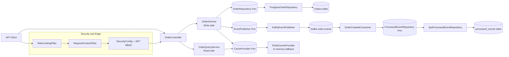
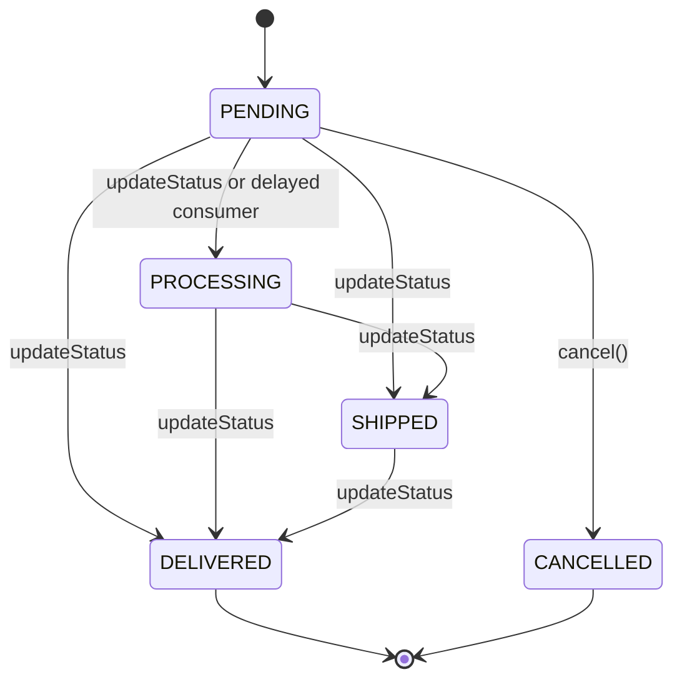

# Order Processing System - Project Documentation

This site documents the complete backend system design, implementation choices, runtime behavior, and class-level structure.

## What this project is

A production-style Java Spring Boot backend for e-commerce order processing with:

- Hexagonal architecture with clear ports/adapters
- CQRS split between write and read services
- Domain aggregate (`Order`) with State Pattern
- Event-driven delayed processing through Kafka
- Idempotency and optimistic locking for race safety
- JWT auth, RBAC, validation, and rate limiting
- Structured logs, metrics, and tracing for observability

## Interactive diagrams

### End-to-end request and event flow



### Order state machine



## Documentation map

- [Design and Architecture](./design-and-architecture.md)
- [Components and Tooling Rationale](./components-and-tooling.md)
- [Observability, Logging, Monitoring](./observability-and-operations.md)
- [Folder and Class Reference](./folder-and-class-reference.md)
- [Testing and Quality Strategy](./testing-and-quality.md)

## Runtime prerequisites

- Java 17
- Maven 3.9+
- Kafka broker (for event flow)
- Optional OTEL collector for trace export (`http://localhost:4318/v1/traces`)

## Local run

```bash
mvn clean test
mvn spring-boot:run
```
