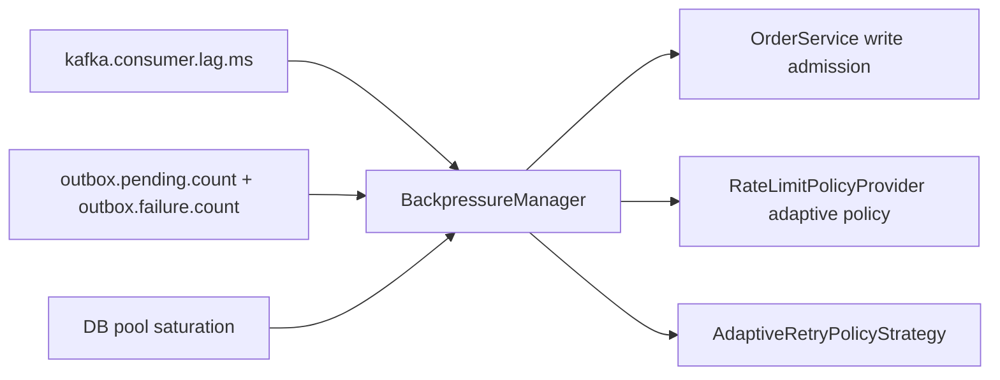

# Observability, Logging, Monitoring, and Operations

## 1. Logging Model

Structured logging fields include:

- `timestamp`, `level`, `logger`, `message`
- `request_id` from `RequestContextFilter`
- `region_id` from `RequestContextFilter`
- `order_id` from service-level MDC context
- `trace_id` from tracing context

`X-Request-Id` is accepted/generated and returned to clients, enabling incident correlation.

## 2. Metrics Catalog (Current Implementation)

### HTTP and API metrics

- `http.server.request.count`
- `http.server.request.latency` (p95, p99)
- `http.server.request.errors`
- `http.server.requests.by.region`

### Business and service metrics

- `orders.service.request.count`
- `orders.created.count`
- `orders.idempotency.hit.count`
- `orders.operation.failure.count`
- `orders.operation.duration`
- `orders.query.request.count`
- `orders.query.error.count`
- `orders.query.duration`

### Cache metrics

- `cache.hit.count`
- `cache.miss.count`
- `cache.error.count`
- `cache.degraded.mode.count`
- `redis.connection.failures` (tagged by component)
- `redis.command.latency` (tagged by command/component)

### Rate limiting metrics

- `rate_limit.allowed.count`
- `rate_limit.blocked.count`
- `rate_limit.dynamic.adjustments`
- `rate_limit.rejections.by.policy`

### Adaptive retry and backpressure metrics

- `retry.delay.ms`
- `retry.classification.count` (`TRANSIENT`, `SEMI_TRANSIENT`, `PERMANENT`)
- `backpressure.level`
- `backpressure.outbox.backlog`
- `backpressure.kafka.lag.ms`
- `backpressure.db.saturation.percent`

### Outbox metrics

- `outbox.pending.count`
- `outbox.failure.count`
- `outbox.publish.latency`
- `outbox.batch.size`
- `outbox.publish.rate`
- `outbox.lag`
- `outbox.retry.count`

### Kafka and schema metrics

- `kafka.consumer.errors`
- `kafka.consumer.lag.ms`
- `kafka.consumer.processed.count`
- `kafka.consumer.retry.count`
- `kafka.consumer.dlq.count`
- `kafka.schema.validation.errors`
- `kafka.event.version.distribution`

### Regional resilience metrics

- `failover.events.count`
- `region.health.unhealthy.count`
- `region.health.dependency.failure.count`
- `region.conflict.rejected.count`

## 3. Tracing

Configured through Micrometer bridge and OTLP endpoint:

- `management.tracing.sampling.probability`
- `management.otlp.tracing.endpoint`

Use traces + request_id for end-to-end debugging.

## 4. Reliability and Retry Behavior

### Outbox pipeline (`OutboxPublisher` + `OutboxFetcher` + `OutboxProcessor` + `OutboxRetryHandler`)

- Scheduler dispatches owned partitions with in-flight semaphore backpressure.
- Fetcher claims rows in transaction, records `outbox.batch.size`, and preserves deterministic aggregate ordering.
- Processor performs async publish, tracks publish latency/rate/lag, and marks `SENT` on completion.
- Retry handler updates retry count, classifies failure type, computes adaptive delay (retry count + system pressure + jitter + cap), and parks terminal/permanent failures.
- Kafka publisher is async and single-attempt; retry/backoff policy is intentionally owned by outbox to keep retry control deterministic.
- Cleanup archives/deletes old `SENT` rows on retention schedule.

### Kafka consumer

- Manual ack mode (`manual_immediate`) with ack after transactional processing success.
- Dedupe check + domain update + processed marker insertion executed in transaction template boundary.
- Retry topics with exponential backoff and max attempts; DLT handler logs payload context and headers.
- Versioned schema parsing with fallback compatibility logic.
- `read_committed` consumption prevents seeing aborted transactional producer records.
- Kafka lag measurements feed `BackpressureManager` for global admission/throttling decisions.

## 5.1 Feedback Loops and Signal Propagation

## 6. Operational Alerts and Interpretation

### High outbox backlog

- Signals: rising `outbox.pending.count` and `outbox.failure.count`
- Likely causes: broker issues, schema failures, retry pressure
- Actions: validate broker health, inspect retry logs, verify schema errors

### Elevated cache degradation

- Signals: rising `cache.error.count` / `cache.degraded.mode.count`
- Likely causes: Redis connectivity/latency issues
- Actions: check Redis health, verify fallback DB latency capacity

### Retry storm / DLT growth

- Signals: rising `kafka.consumer.retry.count`, `kafka.consumer.dlq.count`
- Likely causes: malformed payloads, persistent downstream dependency issues
- Actions: inspect DLT payload contexts, classify and replay only safe records

## 7. DLQ Operations Guidance

When `kafka.consumer.dlq.count` rises:

1. Inspect DLQ logs with `eventId`, `orderId`, topic/partition/offset.
2. Classify failures:
   - payload/schema issues
   - missing order records
   - persistent downstream failures
3. Decide replay/ignore policy.
4. Apply fix and replay if safe.

## 8. Real-world Monitoring Scenarios

### Scenario: Kafka outage

Symptoms:

- rising `outbox.pending.count`
- rising `outbox.failure.count`
- stable API latency (writes still commit)

Action:

- restore Kafka
- confirm outbox drain by falling pending/failure gauges

### Scenario: Redis instability

Symptoms:

- rising `cache.error.count`
- rising `cache.degraded.mode.count`
- possibly rising DB read load

Action:

- restore Redis
- verify cache hits recover

### Scenario: abusive traffic or bot spikes

Symptoms:

- rising `rate_limit.blocked.count`
- rising `rate_limit.dynamic.adjustments` during pressure events

Action:

- tune token bucket limits/window
- add edge/WAF controls if needed

### Scenario: consumer retry storm

Symptoms:

- rising `kafka.consumer.retry.count`
- lag rising
- potential DLQ increase

Action:

- inspect root cause class of retries
- verify retry bounds and delay settings
- scale consumers / fix downstream dependency

### Scenario: regional failover event

Symptoms:

- `failover.events.count` increments
- increased 503 on write endpoints in passive node
- request logs include impacted `region_id`

Action:

1. Validate root cause (DB/Redis/Kafka health in region).
2. Confirm global traffic router moved writes to healthy region.
3. Track recovery and verify node returns active state.

### Scenario: active-active conflict suppression

Symptoms:

- rising `region.conflict.rejected.count`
- elevated concurrent writes from multiple regions

Action:

1. verify conflict policy mode (`last-write-wins` vs `version-based`)
2. inspect conflicting event/order timestamps and versions
3. ensure upstream routing consistency for hot aggregates

## 9. Runbook Checkpoints

- Verify Kafka connectivity and topic health.
- Verify Redis availability and latency.
- Verify Prometheus scraping `/actuator/prometheus`.
- Verify trace export endpoint and sampling settings.
- Verify outbox backlog and DLQ trends on deployments.
- Verify regional health and failover mode in `/actuator/health` (`multiRegion`).

