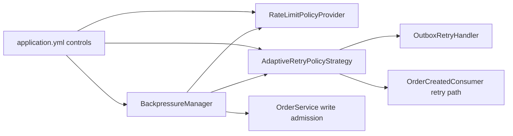

# Configuration and Runtime Controls

## Configuration Package Layout

- `config/security/SecurityConfig`
  - JWT resource server
  - route authorization rules
  - authentication/authorization error responses
- `config/redis/RedisLettuceConfig`
  - Redis/Lettuce client setup
  - timeout/reconnect/pooling tuning
- `config/TransactionConfig`
  - shared `TransactionTemplate` bean for explicit transactional boundaries
- `config/OutboxAsyncConfig`
  - `outboxDbUpdateExecutor` (`ThreadPoolTaskExecutor`) for post-Kafka-send outbox DB updates (`app.outbox.publisher.db-update-pool-size`)
- `config/kafka`
  - package reserved for Kafka-focused runtime wiring
- `config/observability`
  - package reserved for observability-focused runtime wiring

## `application.yml` Controls

### Outbox and publisher controls

- `app.outbox.max-retries`
- `app.outbox.backoff-base-ms`
- `app.outbox.backoff-max-ms`
- `app.outbox.backoff-jitter-percent`
- `app.outbox.partition.total`
- `app.outbox.partition.instance-id`
- `app.outbox.partition.instance-count`
- `app.outbox.publisher.poll-ms`
- `app.outbox.publisher.batch-size`
- `app.outbox.publisher.parallelism`
- `app.outbox.publisher.max-in-flight`
- `app.outbox.publisher.db-update-pool-size` — threads for `OutboxProcessor` completion callbacks (offloads Kafka producer I/O threads)
- `app.outbox.publisher.slow-kafka-threshold-ms`
- `app.outbox.cleanup.retention-days`
- `app.outbox.cleanup.poll-ms`

### Kafka publish and consumer controls

- `app.kafka.order-events-topic`
- `app.kafka.consumer-group`
- `spring.kafka.producer.transaction-id-prefix`
- `spring.kafka.producer.properties.enable.idempotence`
- `spring.kafka.producer.properties.acks`
- `spring.kafka.producer.properties.max.in.flight.requests.per.connection`
- `spring.kafka.consumer.properties.isolation.level`
- `app.kafka.consumer-retry-attempts`
- `app.kafka.consumer-retry-delay-ms`
- `app.kafka.publisher.circuit-breaker.failure-threshold`
- `app.kafka.publisher.circuit-breaker.open-seconds`

### Scheduled order promotion

- `app.scheduling.pending-to-processing-ms` — fixed-rate interval for the background job that transitions `PENDING` → `PROCESSING` (default five minutes). This is separate from Kafka consumption.
- `app.scheduling.pending-promotion-batch-size` — max `PENDING` rows loaded per sweep iteration (bounded memory; default 500).

### Multi-region and idempotency controls

- `app.multi-region.enabled`
- `app.multi-region.region-id`
- `app.multi-region.failover.mode`
- `app.multi-region.failover.rto-seconds`
- `app.multi-region.failover.rpo-seconds`
- `app.multi-region.auto-failover.poll-ms`
- `app.multi-region.auto-failover.unhealthy-threshold`
- `app.multi-region.auto-failover.healthy-threshold`
- `app.multi-region.health.check-timeout-ms`
- `app.multi-region.health.redis-latency-threshold-ms`
- `app.multi-region.health.db-failure-threshold`
- `app.multi-region.health.redis-failure-threshold`
- `app.multi-region.health.kafka-failure-threshold`
- `app.multi-region.global-idempotency.lock-ttl-seconds`
- `app.multi-region.global-idempotency.completed-ttl-seconds`
- `app.multi-region.consistency.conflict-resolution`

### Dynamic rate-limit and backpressure controls

- `app.security.rate-limit.requests`
- `app.security.rate-limit.window-ms`
- `app.security.rate-limit.policy-cache-ttl-ms`
- `app.query.list-max-rows`
- `app.backpressure.poll-ms`
- `app.backpressure.outbox.elevated-backlog`
- `app.backpressure.outbox.critical-backlog`
- `app.backpressure.kafka.elevated-lag-ms`
- `app.backpressure.kafka.critical-lag-ms`
- `app.backpressure.db.elevated-utilization`
- `app.backpressure.db.critical-utilization`

## Operationally Important Runtime Flags

- idempotency header remains optional; behavior changes when key absent/present
- passive mode blocks writes but does not block reads
- outbox retry ceiling and backoff strongly influence event freshness
- adaptive retry classification influences reattempt pressure and terminalization rates
- scheduler interval (`app.scheduling.pending-to-processing-ms`) bounds how soon bulk `PENDING` orders move to `PROCESSING`; Kafka consumer retry settings affect only event acknowledgment, not that promotion cadence
- `read_committed` consumer mode avoids uncommitted transactional records
- backpressure thresholds directly impact write admission and dynamic throttling
- `app.query.list-max-rows` bounds legacy list responses to avoid accidental full-result scans

## Principal Hardening Properties

| Property | Purpose | Default |
|---|---|---|
| `app.outbox.publisher.max-in-flight` | hard cap of concurrent async outbox publishes | `16` |
| `app.outbox.publisher.parallelism` | partition worker parallelism | `8` |
| `app.query.list-max-rows` | upper bound for legacy `/orders` list reads | `1000` |

## Runtime Control Feedback Loop

## Transaction Manager Boundaries

- Write and read services explicitly bind to DB transaction manager:
  - `OrderService`: `@Transactional(transactionManager = "transactionManager")`
  - `OrderQueryService`: `@Transactional(transactionManager = "transactionManager", readOnly = true)`
- This is required because Kafka transactional publishing introduces additional transaction managers and implicit selection can become ambiguous.

## Metrics Touchpoints

- Outbox: `outbox.pending.count`, `outbox.failure.count`, `outbox.batch.size`, `outbox.publish.latency`, `outbox.publish.rate`, `outbox.lag`, `outbox.retry.count`.
- Retry: `retry.delay.ms`, `retry.classification.count`.
- Kafka: `kafka.consumer.errors`, `kafka.consumer.processed.count`, `kafka.consumer.retry.count`, `kafka.consumer.dlq.count`, `kafka.consumer.lag.ms`, `kafka.schema.validation.errors`, `kafka.event.version.distribution`.
- Regional resilience: `failover.events.count`, `region.health.unhealthy.count`, `region.health.dependency.failure.count`, `region.health.redis.slow.count`, `region.health.redis.latency`.
- Regional consistency: `region.conflict.rejected.count`.
- Backpressure: `backpressure.level`, `backpressure.outbox.backlog`, `backpressure.kafka.lag.ms`, `backpressure.db.saturation.percent`.
- Cache and rate limiting: `cache.hit.count`, `cache.miss.count`, `cache.error.count`, `cache.degraded.mode.count`, `rate_limit.allowed.count`, `rate_limit.blocked.count`, `rate_limit.dynamic.adjustments`, `rate_limit.rejections.by.policy`.
