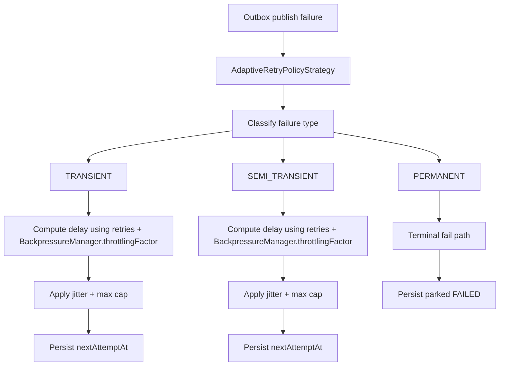
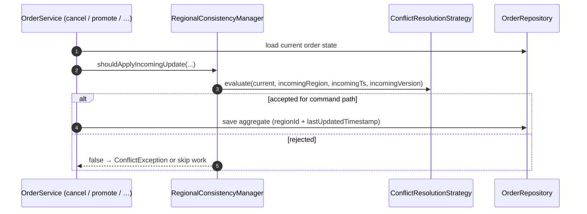
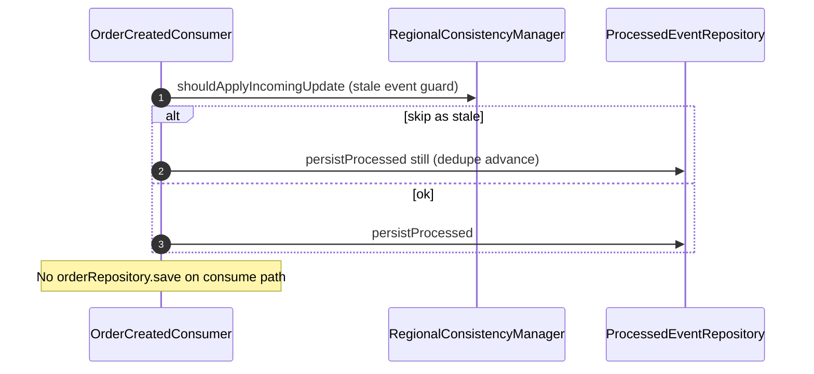

# Infrastructure Layer Reference

## Scope

Infrastructure implements application ports and hosts all external-system integrations (DB, Kafka, Redis, security, regional health).

## Package Map

- `infrastructure/persistence`
  - `adapter`: port implementations over Spring Data repositories
  - `entity`: JPA persistence models and lifecycle hooks
  - `repository`: Spring Data interfaces and custom queries
- `infrastructure/messaging`
  - outbox orchestration and shared messaging exceptions/utilities
- `infrastructure/messaging/retry`
  - adaptive retry classification and delay strategies
- `infrastructure/messaging/producer`
  - Kafka producer adapters
- `infrastructure/messaging/consumer`
  - Kafka listeners, retry-topic integration, DLT handling
- `infrastructure/scheduling`
  - `PendingToProcessingScheduler`: fixed-rate Spring `@Scheduled` job; delegates to `OrderService.promotePendingOrdersScheduled()`
- `infrastructure/messaging/schema`
  - event schema validation and compatibility rules
- `infrastructure/cache`
  - Redis-backed cache adapter with degrade-safe behavior
- `infrastructure/web`
  - request context and distributed rate limiting filters
- `infrastructure/web/ratelimit`
  - dynamic rate-limit policy resolution and Redis-backed policy cache
- `infrastructure/security`
  - JWT claim-to-authority conversion helpers
- `infrastructure/crosscutting`
  - global idempotency state coordinator
- `infrastructure/resilience`
  - regional health/failover, active-active conflict coordination, and backpressure management

## Messaging and Outbox

### Package structure

- `infrastructure/messaging`
- `infrastructure/messaging/producer`
- `infrastructure/messaging/consumer`
- `infrastructure/messaging/schema`

### Outbox pipeline

- `OutboxPublisher`
  - scheduled coordinator
  - partition worker dispatch
  - semaphore-based in-flight backpressure
  - sent-row archive cleanup scheduling
- `OutboxFetcher`
  - partition-aware transactional claim
  - ordered candidate retrieval
- `OutboxProcessor`
  - async publication orchestration
  - success/failure DB transitions run on **`outboxDbUpdateExecutor`** (`whenCompleteAsync`), not on the Kafka producer I/O thread
  - success transition to `SENT`
  - publish latency/rate/lag metrics
- `OutboxRetryHandler`
  - retry count management
  - adaptive classification (`TRANSIENT`, `SEMI_TRANSIENT`, `PERMANENT`)
  - jittered bounded delay + failure reason persistence

#### End-to-end publication sequence (expanded)

1. `OutboxPublisher` polls and selects instance-owned partitions.
2. `OutboxFetcher` claims rows due for retry/publication in a DB transaction.
3. Claimed rows are marked `IN_FLIGHT` with `leaseOwner` and incremented `leaseVersion`.
4. `OutboxProcessor` asynchronously publishes to Kafka via `EventPublisher`.
5. On the dedicated **`outboxDbUpdateExecutor`**, the success handler attempts a fenced transition to `SENT` (avoids blocking the producer I/O thread on DB pool contention).
6. Failure callback delegates to `OutboxRetryHandler`, which computes adaptive delay (same executor path as success).
7. Retry handler writes fenced `FAILED` transition with `nextAttemptAt`.
8. Scheduler permit is released only after async completion to avoid hidden in-flight work.

This sequence is intentionally split so DB atomicity and broker delivery can be reasoned about independently.

### Outbox state model (`OutboxStatus`)

- `PENDING`: ready for first publication
- `IN_FLIGHT`: row is atomically leased by a worker; recoverable when lease expires (`nextAttemptAt`)
- `FAILED`: publish attempt failed; eligible for retry by `nextAttemptAt`
- `SENT`: publication completed successfully; eligible for archival cleanup

### Claiming and concurrency controls

- partition-aware claim prevents worker overlap across partitions
- skip-locked SQL claim avoids lock contention under concurrent schedulers
- claim transaction immediately transitions rows to `IN_FLIGHT` and persists lease expiry before commit
- each claimed batch receives a generated `leaseOwner` token and monotonic `leaseVersion`
- success/failure transitions are conditional (`markSentIfLeased`/`markFailedIfLeased`) using owner+version fencing so stale workers cannot overwrite newer claims
- expired `IN_FLIGHT` leases are reclaimable for crash recovery
- semaphore in publisher limits global in-flight worker pressure
- batch-size controls enforce predictable per-poll work bounds

### Publish completion semantics

- worker slots are released only after async publish futures complete
- this prevents optimistic over-dispatch where scheduler slots free early while broker acks are still pending
- publish and retry callbacks execute fenced state transitions and are safe against lease reclaims

### Producer path (`KafkaEventPublisher`)

- validates/serializes events through schema registry
- preserves per-order key ordering via chained futures
- applies circuit-breaker fail-fast behavior after repeated failures
- sends with Kafka transactions (`executeInTransaction`) and idempotent producer settings
- delegates retries to outbox retry policy

#### Producer failure semantics

- broker send failure is surfaced as exceptional completion
- repeated failures open circuit for cooldown period
- while open, send attempts fail fast and rely on outbox retry windows

### Consumer path (`OrderCreatedConsumer`)

- parses and validates payload
- writes `processed_events` dedupe markers transactionally (does **not** perform `PENDING` → `PROCESSING`; that is handled by `PendingToProcessingScheduler` on a configurable fixed rate)
- uses retry-topic and DLT for failure containment
- consumes with `read_committed` isolation
- feeds lag telemetry into backpressure manager
- applies regional conflict checks before acknowledging (no aggregate promotion in this consumer)

#### Consumer idempotency and safety

- `processed_events` table guards duplicate deliveries
- duplicate marker race on unique constraint is handled safely and acknowledged
- manual acknowledgment occurs only after successful or duplicate-safe processing path

## Resilience and Crosscutting Controls

### `RegionalFailoverManager`

- dependency probes for DB, Redis, Kafka
- threshold-based ACTIVE/PASSIVE switching
- recovery threshold before returning to ACTIVE
- write gating hook consumed by application write service

### `RegionalConsistencyManager`

- wraps failover write-gating with region-aware consistency decisions
- delegates conflict decisions to `ConflictResolutionStrategy`
- emits rejected conflict telemetry

### `BackpressureManager`

- derives pressure level from:
  - Kafka lag (from consumer)
  - outbox backlog (`PENDING` + `FAILED`)
  - DB saturation
- exports level/inputs as gauges
- exposes adaptive throttling factor for rate limits
- exposes critical-pressure write rejection signal for command path

#### Health check strategy

- DB: JDBC connection validity check within timeout
- Redis: ping + latency threshold tracking
- Kafka: cluster metadata + controller + topic-listing validation

### `GlobalIdempotencyService`

- Redis-backed request-key lifecycle state:
  - `IN_PROGRESS`
  - `COMPLETED`
- compatibility parsing for legacy key encodings
- completion mapping used to prevent duplicate creates

### `MultiRegionHealthIndicator`

- exposes current mode and write-eligibility via actuator health
- when the region is **PASSIVE**, reports **`OUT_OF_SERVICE`** (readiness) so load balancers can drain traffic instead of routing to a node that rejects writes

## Persistence Infrastructure

### Adapter responsibilities

- `PostgresOrderRepository`
  - implements `OrderRepository` port
  - maps `OrderRecord` <-> `OrderEntity` to keep infrastructure models out of application contracts
  - find/save operations for order read/write paths
- `JpaOutboxRepository`
  - implements `OutboxRepository`
  - supports save, partition claim, status counts, archive copy, and active-row cleanup
- `JpaProcessedEventRepository`
  - implements `ProcessedEventRepository`
  - dedupe marker existence checks and saves

### Entity intent

- `OrderEntity`
  - durable order snapshot
  - optimistic lock version
  - idempotency key persistence
  - region metadata (`regionId`, `lastUpdatedTimestamp`) for active-active safety
- `OutboxEntity`
  - active outbox row including retry and scheduling metadata
  - failure metadata (`failureType`, `lastFailureReason`) for adaptive retries
  - explicit in-flight lease state plus lease fencing metadata (`leaseOwner`, `leaseVersion`, `nextAttemptAt`)
  - lifecycle hooks initialize defaults and timestamps
- `OutboxArchiveEntity`
  - immutable historical copy of sent events
- `ProcessedEventEntity`
  - consumed-event dedupe marker for idempotent consumers

## Persistence Infrastructure

### Adapters

- `PostgresOrderRepository`
- `JpaOutboxRepository`
- `JpaProcessedEventRepository`

### Spring Data repositories

- `SpringOrderJpaRepository`
- `SpringOutboxJpaRepository`
- `SpringOutboxArchiveJpaRepository`
- `SpringProcessedEventJpaRepository`

### Entities

- `OrderEntity`, `OrderItemEmbeddable`
- `OutboxEntity`, `OutboxArchiveEntity`, `OutboxStatus`
- `ProcessedEventEntity`

## Web and Security Infrastructure

- `RequestContextFilter`: request and region context propagation into MDC/response/metrics
- `RateLimitingFilter`: dynamic policy-driven token bucket with sliding-window fallback and adaptive throttling
- `RateLimitPolicyProvider` / `RedisBackedRateLimitPolicyProvider`: user-tier/endpoint/load policy resolution
- `RoleClaimJwtAuthenticationConverter`: JWT role claim to authority mapping

## Detailed Runtime Flows

### Adaptive retry decision path (outbox publish failures)

`OutboxRetryHandler` uses `AdaptiveRetryPolicyStrategy`. The Kafka **consumer** does **not** use this stack; it uses **`@RetryableTopic`** and a **DLT** handler instead.

### Active-active conflict guard

`RegionalConsistencyManager.shouldApplyIncomingUpdate` delegates to `ConflictResolutionStrategy` (implemented by `VersionBasedConflictResolutionStrategy` using `HybridTimestamp`).

`OrderCreatedConsumer` also calls `shouldApplyIncomingUpdate` before recording dedupe, but it **does not** persist an order mutation on success—only **`processed_events`** (`persistProcessed`).

## Key Metrics by Infrastructure Area

- **Outbox**
  - `outbox.pending.count`, `outbox.failure.count`, `outbox.publish.rate`, `outbox.publish.latency`, `outbox.lag`
- **Kafka consumer**
  - `kafka.consumer.processed.count`, `kafka.consumer.retry.count`, `kafka.consumer.errors`, `kafka.consumer.dlq.count`
- **Schema**
  - `kafka.schema.validation.errors`, `kafka.event.version.distribution`
- **Cache/Redis**
  - `cache.hit.count`, `cache.miss.count`, `cache.error.count`, `cache.degraded.mode.count`, `redis.connection.failures`
- **Rate limiting**
  - `rate_limit.allowed.count`, `rate_limit.blocked.count`, `rate_limit.dynamic.adjustments`, `rate_limit.rejections.by.policy`
- **Adaptive retry**
  - `retry.delay.ms`, `retry.classification.count`
- **Backpressure**
  - `backpressure.level`, `backpressure.outbox.backlog`, `backpressure.kafka.lag.ms`, `backpressure.db.saturation.percent`
- **Regional consistency**
  - `region.conflict.rejected.count`
- **Regional failover**
  - `failover.events.count`, `region.health.unhealthy.count`, `region.health.dependency.failure.count`

## Infrastructure Failure Matrix

| Area | Failure | Protective behavior | Outcome |
|---|---|---|---|
| Outbox publish | Kafka unavailable | `IN_FLIGHT` lease + adaptive retry/backoff + failed status | eventual publication after recovery |
| Consumer | duplicate delivery | processed-event dedupe | no duplicate state mutation |
| Cache | Redis failure | fail-soft read path | DB fallback, higher latency possible |
| Rate limiting | Redis script error | fail-open policy | availability prioritized over throttling |
| Regional control | repeated dependency failure | switch to passive | writes gated until healthy |
