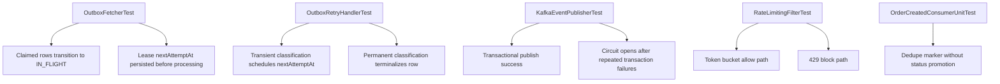

# Testing and Quality

## 1. Testing Objectives

- validate correctness of domain transitions and write invariants
- verify idempotency lifecycle semantics under retries/concurrency
- prove outbox/event flow reliability under failure conditions
- ensure API contracts remain stable for success and error paths
- verify degradation behavior for Redis/Kafka/regional dependencies

## 2. Current Test Coverage (Implemented)

### Domain layer

- `OrderAggregateTest`
  - valid transition paths
  - invalid transition conflicts
  - cancellation invariants

### Application layer

- `OrderServiceIdempotencyLifecycleTest`
  - same key same outcome
  - in-progress duplicate rejection and safe retry
  - completed reuse behavior
  - duplicate prevention under concurrent retries
- `OutboxServiceTest`
  - outbox row creation shape and defaults

### Messaging/outbox components

- `OutboxProcessorTest`
- `OutboxFetcherTest`
- `OutboxPublisherTest`
- `KafkaEventPublisherTest`
- `OrderCreatedConsumerUnitTest`
- `OutboxRetryHandlerTest`

Coverage focus:

- async publish result handling
- atomic outbox lease transitions (`IN_FLIGHT`) at claim time
- lease-fenced finalization (`markSentIfLeased`/`markFailedIfLeased`) to prevent stale worker overwrite
- retry transitions, adaptive classification, and scheduling metadata
- consumer dedupe (without automatic status promotion; scheduler owns `PENDING` → `PROCESSING`)
- transactional Kafka publish path and circuit-open behavior

### Infrastructure/resilience

- `RedisCacheProviderTest`
- `RateLimitingFilterTest`
- `RegionalFailoverManagerTest`

Coverage focus:

- cache hit/miss/degraded behavior
- limiter allow/block with dynamic policy input and fail-open fallback
- active/passive switching and write gating signals

### API integration

- `OrderControllerIntegrationTest`
  - JWT-authenticated create/read; mock JWT uses **explicit `ROLE_*` authorities** (test `jwt()` does not apply `RoleClaimJwtAuthenticationConverter` to claims)
  - idempotency behavior at HTTP boundary
  - validation and error contract behavior
  - **Read scope:** `404` when fetching another user’s order by id; admin can read any order; list contains only caller’s orders for non-admin
  - **Cancel scope:** own order, reject other user (`403`), admin can cancel another user’s order

## 2.1 Continuous integration

- **Workflow:** `.github/workflows/ci.yml`
- **Trigger:** push to `main` / `master` / `docs`; pull requests to `main` / `master`
- **Command:** `mvn -B clean test` on `ubuntu-latest`, JDK 17 (Temurin), Maven cache enabled

## 3. Critical Test Flows

## 4. Test Design Standards

- deterministic and independent test execution
- meaningful assertions on business outcomes, not implementation details
- minimal over-mocking of core orchestration logic
- integration tests for cross-component critical paths

## 5. Residual Gaps / Next Expansion

- embedded Kafka end-to-end verification (outbox → producer → consumer → dedupe marker)
- crash-injection integration around outbox lease expiry/reclaim path
- deterministic active-recovery-to-active integration with controlled dependency health
- conflict resolution strategy permutations under concurrent active-active writes
- backpressure-level transitions driving write admission and dynamic throttling
- dedicated **`GET /orders/page`** contract tests for total count semantics under **owner scoping** (if product requires strict guarantees)
- ArchUnit / architecture tests for layer boundaries (optional)

## 7. Principal Reliability Test Matrix

### P0 contract scenarios

- stale callback rejection: old lease owner/version must fail state transition after reclaim
- async completion bounding: configured in-flight publish cap must hold under slow broker acks
- listener liveness: consumer retry path must not block poll loop threads

### P1/P2 operational scenarios

- bounded list behavior at high data volume for `/orders` and `/orders/page`
- backpressure transition correctness (`NORMAL` -> `ELEVATED` -> `CRITICAL`) and write gating
- DLQ growth alerts and replay readiness validation

## 6. Quality Gates

- `mvn clean compile` must pass; **`mvn clean test`** is enforced on CI for mainline branches
- targeted reliability suites should pass before broad runs
- API, idempotency, and **authorization (read/cancel)** regression tests are mandatory for changes touching `OrderService`, `OrderQueryService`, or security

