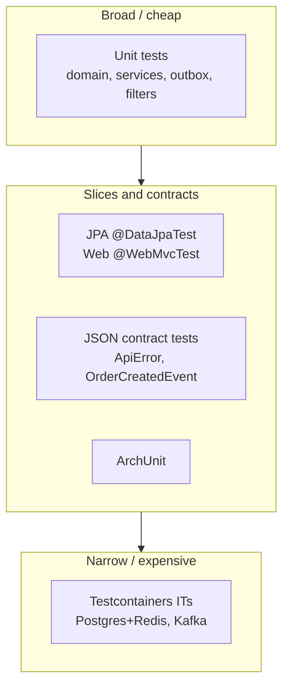
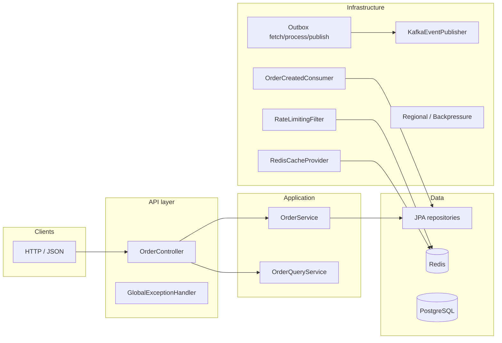
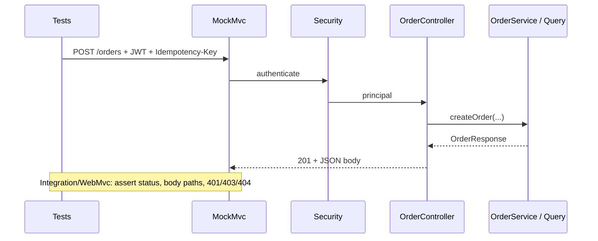
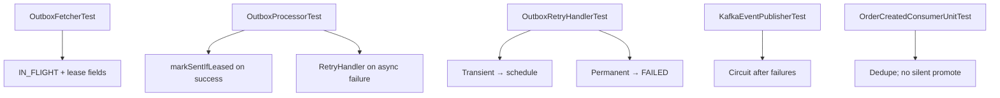

# Testing and Quality

This document is the single source of truth for **what we test**, **how tests are classified**, **which product behaviors they prove**, **what we assert**, **how to run the suite**, and **what is still missing**. Update it whenever you add or materially change a test.

---

## 1. Objectives

| Objective | What “good” means in tests |
| --- | --- |
| **Domain correctness** | Order lifecycle and cancellation rules hold; illegal transitions throw or are rejected. |
| **Idempotency and concurrency** | Same idempotency key yields one order; `IN_PROGRESS` blocks duplicates; recovery works; parallel retries do not fork rows. |
| **Outbox and messaging** | Claims set lease metadata; publish success marks `SENT` via `markSentIfLeased`; failures route to retry policy; Kafka publisher circuit opens after repeated failures. |
| **Consumer semantics** | Inbound events dedupe without silently changing order status when the scheduler owns promotion. |
| **HTTP and JSON contracts** | Status codes, `ApiError` codes, and stable JSON keys for errors and domain DTOs where contract-tested. |
| **Infrastructure behavior** | Cache hit/miss/degrade; rate limit allow vs `429`; regional passive mode blocks writes and surfaces in health. |
| **Backpressure** | Level (`NORMAL` / `ELEVATED` / `CRITICAL`) and `shouldRejectWrites` / throttling factor from backlog and pool/lag signals (mocked). |
| **Persistence** | JPA queries order and filter correctly; processed-event table enforces uniqueness. |
| **Architecture** | Domain packages do not depend on infrastructure or Spring Framework types. |
| **Real dependencies (IT)** | App context starts against Postgres + Redis and (separately) Kafka bootstrap from Testcontainers. |

---

## 2. Visual overview

### 2.1 Test pyramid (volume vs. scope)

Broader, slower tests are fewer; fast unit tests are the bulk of the suite.

### 2.2 Where tests attach to the system (logical map)

This is **not** a deployment diagram; it shows **which layer** each family of tests targets.

**Attachment points (examples):**

| Attachment | Test examples |
| --- | --- |
| Raw domain | `OrderAggregateTest` |
| Service + ports | `OrderServiceIdempotencyLifecycleTest`, `OutboxServiceTest` |
| HTTP + security | `OrderControllerIntegrationTest`, `OrderControllerWebMvcTest` |
| Error mapping | `GlobalExceptionHandlerTest`, `ApiErrorJsonContractTest` |
| Outbox pipeline | `OutboxFetcherTest`, `OutboxProcessorTest`, `OutboxPublisherTest`, `OutboxRetryHandlerTest` |
| Kafka producer | `KafkaEventPublisherTest` |
| Consumer | `OrderCreatedConsumerUnitTest`, `OrderCreatedEventContractTest` |
| Cross-cutting | `RateLimitingFilterTest`, `RedisCacheProviderTest`, `RegionalFailoverManagerTest`, `BackpressureManagerResilienceTest` |
| DB mapping | `SpringOrderJpaRepositoryDataJpaTest`, `SpringProcessedEventJpaRepositoryDataJpaTest` |
| Full stack + containers | `PostgresRedisContainersApplicationIT`, `KafkaContainerApplicationIT` |

### 2.3 Request/response path with assertion focus (HTTP slice)

---

## 3. Test types (reference)

Each row is a **category** used in this repo. A single class stays in one primary category; `OrderControllerIntegrationTest` is **API integration** (MockMvc + full security stack + `@MockBean` repositories), not Testcontainers.

| Type | Definition | Typical annotations / tools | What we usually assert |
| --- | --- | --- | --- |
| **Unit** | Isolated class under test; collaborators mocked or in-memory fakes. | JUnit 5, Mockito | State changes, return values, exceptions, `verify(...)` on mocks. |
| **JPA slice** | Spring Data + Hibernate only; embedded DB. | `@DataJpaTest`, `@AutoConfigureTestDatabase`, H2 | Entity counts, page content order, `existsBy...`, DB constraint exceptions. |
| **Web slice** | Dispatcher, controller, validation, security filter chain; no real DB. | `@WebMvcTest`, `MockMvc`, `jwt()` | HTTP status, `jsonPath`, validation `400` without invoking services for real. |
| **API integration (in-process)** | Same as web slice breadth but often more scenarios; may use `@SpringBootTest` + MockMvc + mocks—this project uses a dedicated integration test class. | `MockMvc`, `@MockBean` | End-to-end HTTP rules: auth, idempotency headers, role behavior. |
| **Contract** | Serialized shape stability for integrations (BFFs, consumers). | Jackson, fixed JSON strings | Presence of JSON keys; values for canonical payloads; backward compatibility. |
| **Architecture** | Dependency rules between packages. | ArchUnit `@AnalyzeClasses` | No forbidden edges between package sets. |
| **Resilience (simulated)** | Threshold and policy behavior with mocks—not production fault injection. | Mockito, `HikariPoolMXBean` mock | `BackpressureManager` level, `shouldRejectWrites`, throttling factor. |
| **Integration (Testcontainers)** | Real processes: Postgres, Redis, Kafka broker. | `@SpringBootTest`, Testcontainers | Context starts; JDBC / Redis / `KafkaTemplate` wiring smoke checks. |

---

## 4. How to run

| Command | When to use |
| --- | --- |
| `mvn clean test` | Full suite: unit, slices, contracts, ArchUnit, resilience mocks, and **Testcontainers ITs if Docker is available**. |
| `mvn -Dtest='!*IT' test` | Skip classes whose names end with `IT` (no Docker / faster feedback). |

**Docker:** `PostgresRedisContainersApplicationIT` and `KafkaContainerApplicationIT` use `@Testcontainers(disabledWithoutDocker = true)`. No Docker → those tests are **skipped**, not failed.

**Coverage report:** `target/site/jacoco/index.html` after `mvn clean test`.

---

## 5. Detailed test catalog (features and assertions)

Convention: **Feature** = product or technical behavior under test. **Assertions** = observable outcomes checked in that test (not every `assert` line, but the intent).

### 5.1 Domain (unit)

| Class | Test / method | Feature under test | Assertions (summary) |
| --- | --- | --- | --- |
| `OrderAggregateTest` | `shouldAllowValidLifecycleTransitions` | Valid status chain | Final status `DELIVERED`. |
| | `shouldRejectInvalidTransitionFromDelivered` | Terminal state immutability | `ConflictException` when moving from `DELIVERED`. |
| | `shouldAllowCancelOnlyWhenPending` | Cancel rules | `PENDING` → `CANCELLED`; non-pending cancel throws. |
| | `shouldPromotePendingOnlyOnce` | Idempotent promotion | First `promotePendingToProcessing` true; second false; stays `PROCESSING`. |

### 5.2 Application services (unit)

| Class | Test / method | Feature under test | Assertions (summary) |
| --- | --- | --- | --- |
| `OrderServiceIdempotencyLifecycleTest` | `sameRequestSameKeyReturnsSameOrder` | Idempotent create | Two creates same UUID; one persisted row. |
| | `inProgressStatePreventsDuplicateThenRetrySucceeds` | Crash window | Error while `IN_PROGRESS`; after clear, create succeeds once. |
| | `completedStateAlwaysReusesSameOrder` | Completed idempotency | All calls return same id; one row. |
| | `concurrentRetriesDoNotCreateDuplicateOrders` | Concurrent idempotency | One row in repo; one success UUID; one failure whose message matches in-progress/ conflict pattern. |
| `OrderServiceScheduledPromotionTest` | `promotePendingOrdersScheduled_movesAllPendingToProcessing` | Scheduler sweep | Both pending orders become `PROCESSING`. |
| `OutboxServiceTest` | `enqueueOrderCreatedPersistsPendingOutboxWithPartitionAndPayload` | Enqueue outbox row | Captured entity: aggregate type/id, event type, payload, `PENDING`, retry 0, partition from hash, `nextAttemptAt` set. |
| `OrderMapperTest` | `toDomainItems_mapsAllFields` | Request → domain items | Product, quantity, price per line. |
| | `toDomain_roundTripsRecord` | `OrderRecord` → `Order` | Id, status, owner, version, items. |
| | `toResponse_mapsDomainToDto` | `Order` → `OrderResponse` | Id, status, item list fields. |
| | `toRecord_includesRegionAndItems` | `Order` → `OrderRecord` | `regionId`, `lastUpdatedTimestamp`, items. |
| | `toEmbeddablesFromRecord_mapsItemRecords` | JPA embeddables | Product, quantity, price on embeddables. |
| `PendingToProcessingSchedulerTest` | `promotePendingOrders_delegatesToOrderService` | Cron → service | `promotePendingOrdersScheduled()` called. |
| | `promotePendingOrders_swallowsRuntimeExceptionFromService` | Resilience | Exception from service does not propagate; delegate still verified. |
| `RegionalConsistencyManagerTest` | `allowsWrites_delegatesToFailoverManager` | Write gating | Mirrors `RegionalFailoverManager.allowsWrites()`. |
| | `shouldApplyIncomingUpdate_delegatesToStrategy` | Conflict strategy | Returns strategy decision. |
| | `shouldApplyIncomingUpdate_incrementsCounterWhenRejected` | Metrics on reject | `region.conflict.rejected.count` incremented when strategy rejects. |

### 5.3 HTTP — exception mapping and error envelope (unit)

| Class | Test / method | Feature under test | Assertions (summary) |
| --- | --- | --- | --- |
| `GlobalExceptionHandlerTest` | `handleNotFound_*` | `NotFoundException` | `404`, body code `NOT_FOUND`. |
| | `handleConflict_*` | `ConflictException` | `409`, `CONFLICT`. |
| | `handleForbidden_*` | `ForbiddenException` | `403`. |
| | `handleInfrastructure_*` | `InfrastructureException` | `503`, code `INFRASTRUCTURE_ERROR`, safe user message. |
| | `handleValidation_*` | `MethodArgumentNotValidException` | `400`, `VALIDATION_FAILED`, message mentions fields. |
| | `handleMalformedJson_*` | Bad JSON | `400`, `MALFORMED_REQUEST`. |
| | `handleConstraintViolation_*` | Constraint violations | `400`. |
| | `handleBadRequest_*` | `IllegalArgumentException` | `400`, `BAD_REQUEST`. |
| | `handleUnexpected_*` | Unknown errors | `500`; Micrometer counter `api.errors.unexpected` incremented. |

### 5.4 HTTP — contract (JSON keys)

| Class | Test / method | Feature under test | Assertions (summary) |
| --- | --- | --- | --- |
| `ApiErrorJsonContractTest` | `serializesExpectedTopLevelKeys` | Stable error JSON | JSON has `code`, `message`, `requestId`, `timestamp`; values match inputs. |

### 5.5 HTTP — web slice (`@WebMvcTest`)

| Class | Test / method | Feature under test | Assertions (summary) |
| --- | --- | --- | --- |
| `OrderControllerWebMvcTest` | `postOrders_returns201WithBody` | Create order mapping | `201`; `$.id`, `$.status` match mocked service; JWT + idempotency header path. |
| | `postOrders_validationError_returns400` | Bean validation | `400` for `{}`. |
| | `getOrder_returns200` | Get by id | `200`; `$.status` matches mock. |

**Note:** `RateLimitingFilter` is mocked to pass-through; rate-limit behavior is in `RateLimitingFilterTest` and richer scenarios in `OrderControllerIntegrationTest` where applicable.

### 5.6 HTTP — API integration (`OrderControllerIntegrationTest`)

| Test / method | Feature under test | Assertions (summary) |
| --- | --- | --- |
| `shouldRequireAuthentication` | Unauthenticated access | `401` without JWT. |
| `shouldCreateAndFetchOrderWhenAuthorized` | Happy path create + get | `201` then `200`; body consistency. |
| `shouldRejectStatusUpdateForNonAdminRole` | Role guard on admin operation | Non-admin rejected for status update. |
| `shouldValidateHeaderAndPayload` | Validation / headers | `400` for invalid input or missing headers per scenario. |
| `shouldReturnSameOrderForSameIdempotencyKey` | HTTP idempotency | Same key → same order id / no duplicate resource. |
| `shouldCancelOwnPendingOrder` | Owner cancel | Success for owner. |
| `shouldRejectCancelWhenDifferentUser` | Cancel scope | `403` for other user. |
| `shouldAllowAdminToCancelAnotherUsersOrder` | Admin override | Admin can cancel. |
| `shouldReturnNotFoundWhenFetchingAnotherUsersOrder` | Read isolation | `404` for non-owner non-admin. |
| `shouldAllowAdminToFetchAnyOrderById` | Admin read | Admin `200` for any id. |
| `shouldListOnlyOwnOrdersForNonAdmin` | List scope | Non-admin sees only own orders. |
| `shouldListOrdersFilteredByPendingStatus` | Query filter | `status=PENDING` filters results. |
| `shouldAllowAdminToAdvanceStatusToShipped` | Admin PATCH | `PENDING` → `SHIPPED` with version. |

### 5.7 Messaging — outbox and Kafka producer (unit)

| Class | Test / method | Feature under test | Assertions (summary) |
| --- | --- | --- | --- |
| `OutboxFetcherTest` | `claimPartitionBatchMarksRowsInFlightWithinLease` | Claim pipeline | Rows `IN_FLIGHT`; `nextAttemptAt`, `leaseOwner`, `leaseVersion` set; `saveAll` once. |
| `OutboxProcessorTest` | `processBatchMarksEventSentOnAsyncSuccess` | Success path | Status `SENT`; `markSentIfLeased` called; retry handler not used. |
| | `processBatchDelegatesToRetryHandlerOnAsyncFailure` | Publish failure | `retryHandler.handleFailure` invoked. |
| `OutboxPublisherTest` | `pollAndPublishProcessesOwnedPartitionBatchesOnly` | Partition ownership | Only owned partition claimed; processor invoked. |
| | `cleanupSentEventsArchivesAndDeletesBatch` | Sent cleanup | Archive + delete batch APIs called. |
| `OutboxRetryHandlerTest` | `handleFailurePersistsRetryMetadataAndSchedulesNextAttempt` | Transient failure | Retry count, failure metadata, `nextAttemptAt`; `markFailedIfLeased` with expected args. |
| | `handleFailureTerminalizesPermanentFailureImmediately` | Permanent failure | Status `FAILED`; lease-aware update. |
| `KafkaEventPublisherTest` | `publishOrderCreatedCompletesOnAsyncSuccess` | Transactional send | Future completes successfully. |
| | `publishOrderCreatedOpensCircuitAfterConsecutiveFailures` | Circuit breaker | Repeated failures → exceptional completion; `InfrastructureException` in chain. |

### 5.8 Messaging — consumer and event contract

| Class | Test / method | Feature under test | Assertions (summary) |
| --- | --- | --- | --- |
| `OrderCreatedConsumerUnitTest` | `shouldAcknowledgeOrderCreatedWithoutPromotingStatusAndPersistProcessedMarker` | Dedupe without promotion | Order stays `PENDING`; processed-event persisted. |
| `OrderCreatedEventContractTest` | `shouldSerializeWithStableContractFields` | Producer JSON v2 | Keys: `schemaVersion`, `eventId`, `eventType`, `orderId`, `occurredAt`. |
| | `shouldDeserializeCanonicalProducerPayloadV2` | Round-trip v2 | Field equality after deserialize. |
| | `shouldDeserializeBackwardCompatibleV1PayloadWithoutSchemaVersion` | v1 compatibility | Default `schemaVersion` = 1. |
| | `shouldSupportForwardCompatiblePayloadWithFutureVersionAndOptionalFields` | Forward compat | Deserializes with extra fields. |
| | `shouldFailValidationWhenRequiredFieldMissing` | Invalid payloads | Validation error path. |
| | `shouldFailOnNonJsonPayload` | Garbage input | Failure for non-JSON. |

### 5.9 Infrastructure — cache, rate limit, regional, health

| Class | Test / method | Feature under test | Assertions (summary) |
| --- | --- | --- | --- |
| `RedisCacheProviderTest` | `getReturnsParsedValueOnCacheHit` | Cache hit | Optional present; parsed field. |
| | `getReturnsEmptyOnRedisFailureFallback` | Degraded read | Empty optional on Redis error. |
| | `putWithTtlWritesToRedis` | Write path | `set` with TTL verified. |
| `RateLimitingFilterTest` | `allowsRequestWhenTokenBucketAllows` | Allow path | Filter chain proceeds. |
| | `blocksRequestWith429WhenTokenBucketRejects` | Block path | Status `429`; body contains `RATE_LIMITED`. |
| `RegionalFailoverManagerTest` | `switchesToPassiveWhenDependenciesUnhealthy` | Failover | `allowsWrites()` false when unhealthy (multi-region on). |
| | `remainsWritableWhenMultiRegionDisabled` | Feature flag | Writes allowed when multi-region disabled. |
| `MultiRegionHealthIndicatorTest` | `healthIsUpWhenRegionActive` | Active region | Health `UP`. |
| | `healthIsOutOfServiceWhenRegionPassive` | Passive region | `OUT_OF_SERVICE`. |

### 5.10 Resilience — backpressure (mocked signals)

| Class | Test / method | Feature under test | Assertions (summary) |
| --- | --- | --- | --- |
| `BackpressureManagerResilienceTest` | `elevatedWhenOutboxBacklogCrossesElevatedOnly` | Backlog threshold | Level `ELEVATED`; writes not rejected; throttling factor `0.70`. |
| | `criticalWhenBacklogHitsCriticalThreshold` | Critical backlog | Level `CRITICAL`; `shouldRejectWrites`; throttling `0.35`. |
| | `kafkaLagAloneCanElevate` | Lag signal | `recordKafkaLagMs` → `ELEVATED` without backlog. |

### 5.11 Cross-region conflict strategies (unit)

| Class | Test / method | Feature under test | Assertions (summary) |
| --- | --- | --- | --- |
| `HybridTimestampTest` | `from_nullPhysicalUsesZeroMillis` | Factory defaults | Physical millis 0; logical counter preserved. |
| | `from_nullLogicalUsesZero` | Factory defaults | Logical counter 0 when null. |
| | `compareTo_ordersByPhysicalThenLogical` | Total order | Earlier physical or lower logical sorts first. |
| | `compareTo_nullOtherIsGreater` | Null-safe compare | `compareTo(null)` returns 1. |
| `VersionBasedConflictResolutionStrategyTest` | `nullCurrent_alwaysApplies` | First write | Incoming update applies when no current record. |
| | `nullTimestamp_defaultsToApply` | Missing timestamp | Applies when incoming timestamp null. |
| | `newerHybridTimestamp_applies` | Last-write-wins | Newer instant wins. |
| | `olderHybridTimestamp_rejects` | Stale reject | Older instant rejected. |
| | `tieBreak_usesRegionIdWhenBothPresent` | Lexicographic tie-break | Same timestamp: region id ordering decides apply/reject. |

### 5.12 Persistence — JPA slice

| Class | Test / method | Feature under test | Assertions (summary) |
| --- | --- | --- | --- |
| `SpringOrderJpaRepositoryDataJpaTest` | `findByStatusOrderByCreatedAtAsc_returnsOldestFirstPage` | Scheduler ordering query | Total count; first page oldest by `createdAt`. |
| | `findByOwnerSubjectAndStatus_scopesToOwner` | Owner scoping | Only matching owner rows. |
| `SpringProcessedEventJpaRepositoryDataJpaTest` | `existsByEventId_reflectsPersistedMarker` | Dedupe lookup | `existsByEventId` true after save. |
| | `duplicateEventIdViolatesUniqueConstraint` | DB uniqueness | Second insert throws `DataIntegrityViolationException`. |

### 5.13 Architecture

| Class | Rule | Assertions (summary) |
| --- | --- | --- |
| `HexagonalArchitectureTest` | `domainMustNotDependOnInfrastructure` | No `..domain..` → `..infrastructure..` imports. |
| | `domainMustNotDependOnSpringFramework` | No `..domain..` → `org.springframework..` imports. |

### 5.14 Integration — Testcontainers

| Class | Test / method | Feature under test | Assertions (summary) |
| --- | --- | --- | --- |
| `PostgresRedisContainersApplicationIT` | `contextStartsAndJdbcAndRedisRoundTrip` | Real Postgres + Redis | `SELECT 1` = 1; Redis set/get round-trip. |
| `KafkaContainerApplicationIT` | `kafkaTemplateIsWired` | Real Kafka bootstrap | `KafkaTemplate` non-null (context loads against broker). |

---

## 6. Assertion categories (how to read failures)

| Category | Examples in this codebase |
| --- | --- |
| **Equality** | Same UUID for idempotent creates; status enums; JSON field values. |
| **Presence / structure** | `jsonPath`; contract tests `JsonNode.has("code")`. |
| **Exception type** | `ConflictException`, `DataIntegrityViolationException`. |
| **HTTP status** | `401`, `400`, `403`, `404`, `409`, `429`, `503`. |
| **Mock verification** | `verify(repository).markSentIfLeased(...)`; `verify(chain).doFilter` for allow path. |
| **State on entities** | Outbox `IN_FLIGHT`, lease fields, `SENT`, `FAILED`. |
| **Side-effect counters** | Micrometer `api.errors.unexpected`; regional conflict counter. |

---

## 7. Critical messaging flows (compact diagram)

---

## 8. Design standards

- **Deterministic:** No reliance on wall-clock for correctness unless abstracted (schedulers often disabled in IT).
- **Observable outcomes first:** Prefer status codes, JSON, and entity state over internal private methods.
- **Contract tests are strict:** Renaming `ApiError` fields or event JSON keys without a version story should fail CI.
- **Integration tests are smoke + wiring:** They do not replace domain or outbox unit coverage.

---

## 9. Continuous integration

- **Workflow:** `.github/workflows/ci.yml`
- **Trigger:** push to `main` / `master` / `docs`; pull requests to `main` / `master`
- **Command:** `mvn -B clean test` on `ubuntu-latest`, JDK 17 (Temurin), Maven cache
- **Docker:** Runners provide Docker; Testcontainers ITs should execute in CI.

---

## 10. Quality gates

- **`mvn clean compile`** and **`mvn clean test`** must pass on mainline workflows.
- **JaCoCo:** minimum **line coverage ratio 0.65** on the bundle (`jacoco:check`); use HTML report for per-package gaps.
- Changes to **`OrderService`**, **`OrderQueryService`**, or **security** should extend or preserve **`OrderControllerIntegrationTest`** and idempotency coverage where behavior changes.

---

## 11. Residual gaps (honest backlog)

- **Full Kafka E2E:** outbox → publish → consume → dedupe row in one Testcontainers scenario (current ITs: wiring smoke only).
- **Lease expiry / reclaim:** Worker crash simulation and second worker reclaim (unit tests cover logic; not full IT).
- **Active-active multi-region:** Integration beyond `RegionalFailoverManager` mocks.
- **Chaos / toxics:** No Toxiproxy or network partition automation; `BackpressureManagerResilienceTest` is **mocked thresholds only**.
- **`GET /orders/page`:** Dedicated contract for totals and owner scoping if required by product.
- **Kafka log noise:** Admin client may log connection attempts during some context loads; green tests are required; silencing logs is cleanup.

---

## 12. Principal reliability matrix

### P0 (must not regress silently)

- Lease-fenced outbox updates (`markSentIfLeased` / `markFailedIfLeased`) and consumer dedupe semantics.
- Kafka publisher circuit and transactional send behavior under failure.
- Consumer does not promote order status on ingest (scheduler owns `PENDING` → `PROCESSING`).

### P1 / P2 (operational)

- List and page performance at scale (not load-tested here).
- Backpressure levels in production telemetry vs. `BackpressureManagerResilienceTest` doubles.
- DLQ and replay procedures (not automated).

---

**Maintenance:** Add a row to **section 5** (and adjust **section 2.2** if the attachment map changes) when you introduce a test class. Update **section 11** when you close a gap. Update **sections 4, 9, 10** when run instructions, CI, or JaCoCo rules change.
