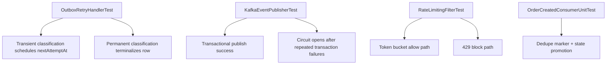

# Testing and Quality

## 1. Testing Objectives

- validate correctness of domain transitions and write invariants
- verify idempotency lifecycle semantics under retries/concurrency
- prove outbox/event flow reliability under failure conditions
- ensure API contracts remain stable for success and error paths
- verify degradation behavior for Redis/Kafka/regional dependencies

## 2. Current Test Coverage (Implemented)

### Domain layer

- `OrderAggregateTest`
  - valid transition paths
  - invalid transition conflicts
  - cancellation invariants

### Application layer

- `OrderServiceIdempotencyLifecycleTest`
  - same key same outcome
  - in-progress duplicate rejection and safe retry
  - completed reuse behavior
  - duplicate prevention under concurrent retries
- `OutboxServiceTest`
  - outbox row creation shape and defaults

### Messaging/outbox components

- `OutboxProcessorTest`
- `OutboxPublisherTest`
- `KafkaEventPublisherTest`
- `OrderCreatedConsumerUnitTest`
- `OutboxRetryHandlerTest`

Coverage focus:

- async publish result handling
- retry transitions, adaptive classification, and scheduling metadata
- consumer dedupe and delayed processing behavior
- transactional Kafka publish path and circuit-open behavior

### Infrastructure/resilience

- `RedisCacheProviderTest`
- `RateLimitingFilterTest`
- `RegionalFailoverManagerTest`

Coverage focus:

- cache hit/miss/degraded behavior
- limiter allow/block with dynamic policy input and fail-open fallback
- active/passive switching and write gating signals

### API integration

- `OrderControllerIntegrationTest`
  - create/read/status/cancel route behavior
  - idempotency behavior at HTTP boundary
  - validation and error contract behavior

## 3. Critical Test Flows

## 4. Test Design Standards

- deterministic and independent test execution
- meaningful assertions on business outcomes, not implementation details
- minimal over-mocking of core orchestration logic
- integration tests for cross-component critical paths

## 5. Residual Gaps / Next Expansion

- embedded Kafka end-to-end verification (outbox -> producer -> consumer)
- explicit no-event-loss crash-injection integration around outbox loop
- deterministic active-recovery-to-active integration with controlled dependency health
- conflict resolution strategy permutations under concurrent active-active writes
- backpressure-level transitions driving write admission and dynamic throttling

## 6. Quality Gates

- `mvn clean compile` must pass
- targeted reliability suites should pass before broad runs
- API and idempotency regression tests are mandatory for write-path changes

