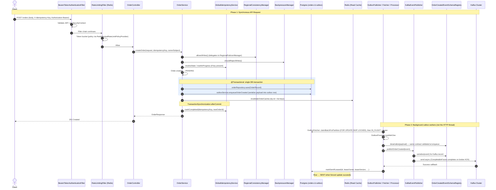
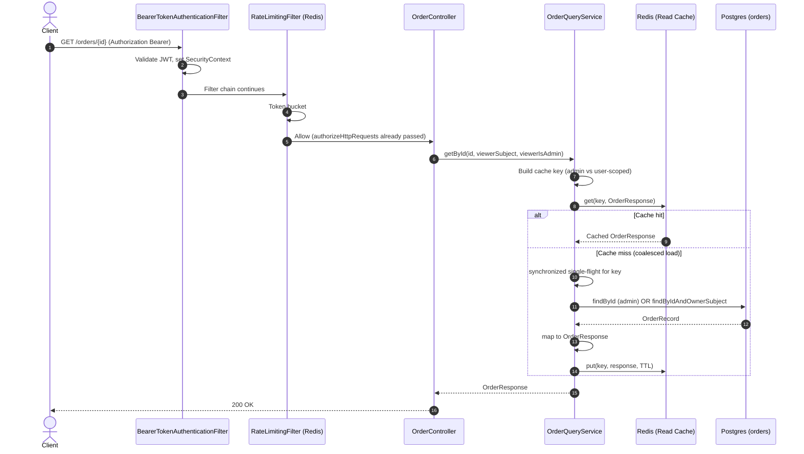
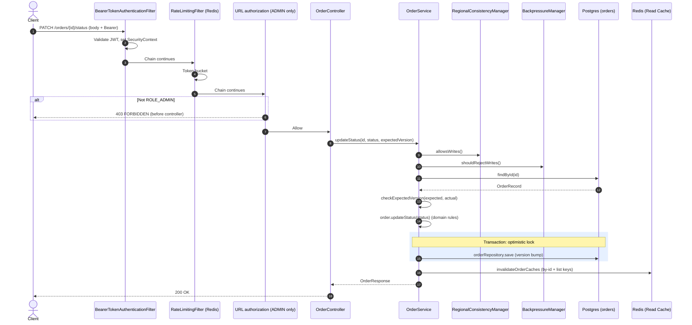
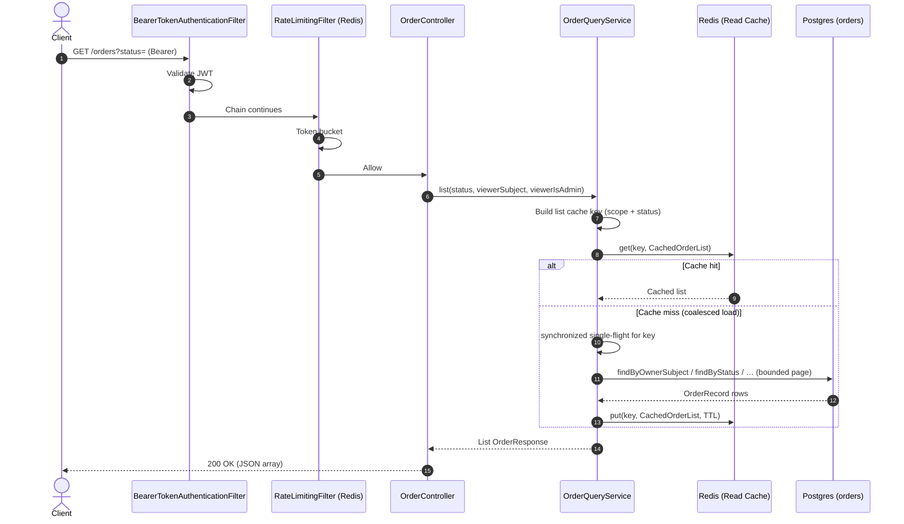
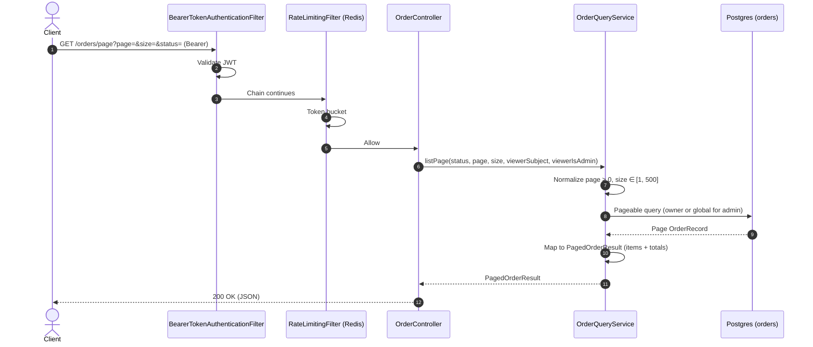
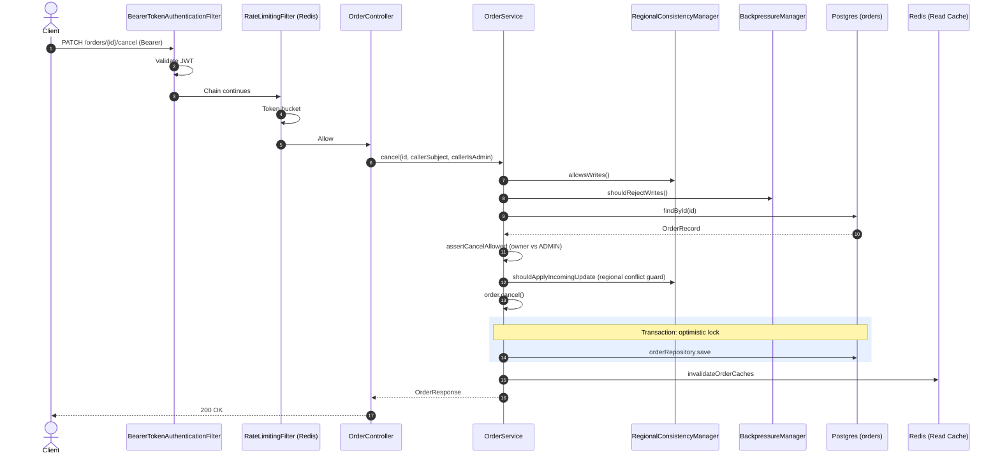

# Use Cases (Controller APIs)

This page documents **successful end-to-end flows** for every HTTP endpoint exposed by `OrderController`, using the same sequence-diagram pattern throughout. Cross-cutting behavior (JWT resource server, filters, and error envelopes) is summarized once; each API then has its own diagram.

---

## Cross-cutting behavior

- **Authentication:** Clients send `Authorization: Bearer <JWT>`. Roles come from the token (`USER` / `ADMIN`) except where noted.
- **Authorization:** See [Security and Authorization]({{ '/security-and-authorization/' | absolute_url }}). Notably, `PATCH /orders/{id}/status` requires **ADMIN** only.
- **Ownership:** On create, the JWT **`sub`** is stored as `ownerSubject`. Reads and cancel (non-admin) are scoped to that owner.
- **Filter chain order (matches `SecurityConfig`):** `BearerTokenAuthenticationFilter` validates the JWT and builds the security context **first**; `RateLimitingFilter` is registered **immediately after** it (`addFilterAfter(rateLimitingFilter, BearerTokenAuthenticationFilter.class)`). URL authorization (`authorizeHttpRequests`) runs later in the same chain, before the controller. Diagrams below show **JWT → rate limit → controller** in that order.
- **Rate limiting:** Redis token bucket (with sliding-window fallback when configured); fail-open if Redis is unavailable for the primary script path.
- **Request correlation:** `RequestContextFilter` is a separate servlet filter (`@Component`); it sets `requestId` / region in MDC for logs and `ApiError` (exact ordering vs. security is managed by Spring Boot filter registration).

---

## POST `/orders` — Create order (optional idempotency)

Synchronous commit includes **regional write gate**, **global idempotency** (Redis), **single DB transaction** (order + outbox row), **cache invalidation**, and **after-commit idempotency completion**. `ORDER_CREATED` publication is **asynchronous** via the outbox pipeline.

---

## GET `/orders/{id}` — Get order by id

Read path uses **cache-aside** with **request coalescing** on cache miss. Admin callers use admin-scoped cache keys; non-admins load only their own orders (cross-tenant id → `404`).

---

## PATCH `/orders/{id}/status` — Update status (ADMIN, optimistic locking)

**ADMIN-only** endpoint. Enforces **regional write gate**, **backpressure**, loads the aggregate, checks **expected version**, applies a **domain transition**, persists with **optimistic locking** (one retry on conflict), then **invalidates** read caches. **No** outbox row is written for this operation in the current implementation.

---

## GET `/orders` — List orders (optional status filter)

Uses **status-scoped list cache keys** (admin vs user) and **coalescing** on miss. Results are **bounded** by `app.query.list-max-rows` (repository page size).

---

## GET `/orders/page` — Paginated list

Same **authorization and scoping** as `GET /orders`, but responses are **paged** (`page`, `size` capped at 500). This path **does not** use the list cache in `OrderQueryService`; each call hits the database (still inside a read-only transaction).

---

## PATCH `/orders/{id}/cancel` — Cancel order

Enforces **write gates**, **ownership** (or **ADMIN** bypass), **regional consistency** check (`RegionalConsistencyManager.shouldApplyIncomingUpdate`), **domain cancel**, **optimistic locking** with retry, then **cache invalidation**.

---

## Related asynchronous flows (not HTTP controllers)

Background behavior (outbox retry, scheduler `PENDING`→`PROCESSING`, Kafka consumer dedupe) is documented with failure-oriented diagrams in [Failure Scenarios]({{ '/failure-scenarios/' | absolute_url }}) and in [Design and Architecture]({{ '/design-and-architecture/' | absolute_url }}).
